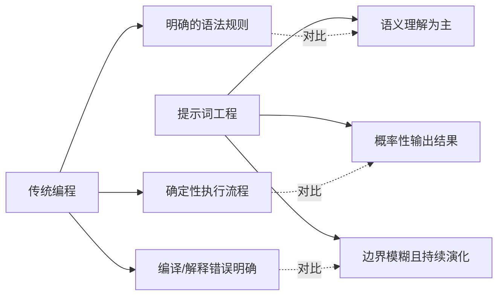
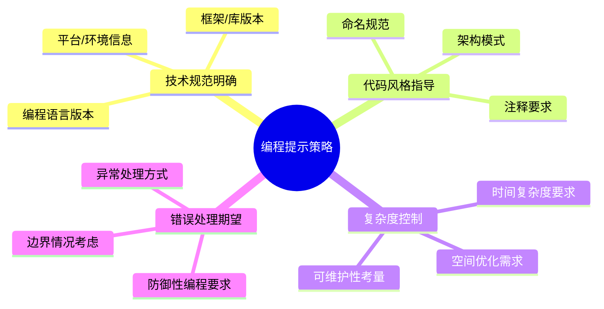
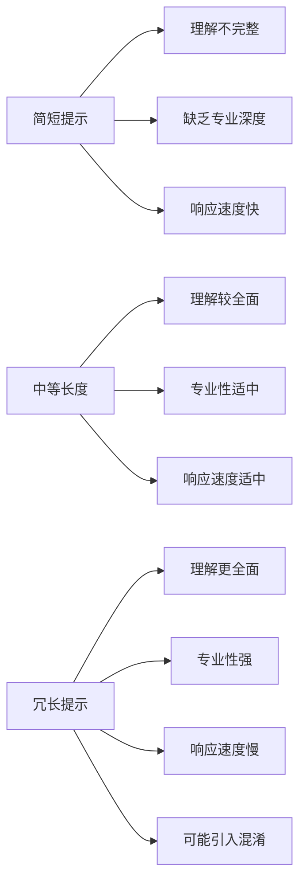
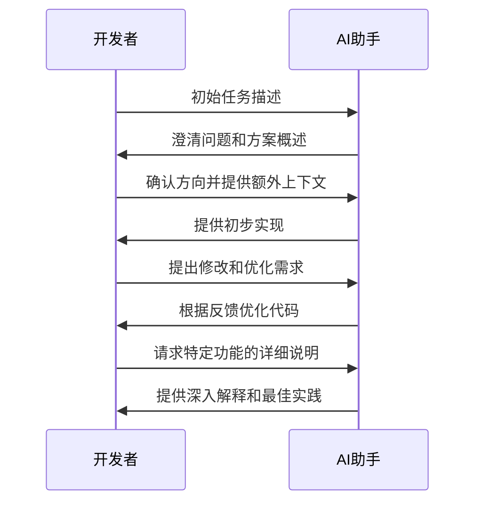
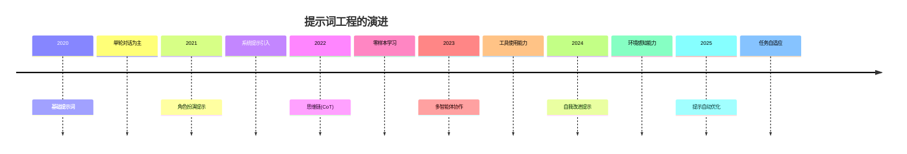

# 提示词工程

## 1. 提示词工程的基本理解

提示词工程（Prompt Engineering）是一门关于如何设计、优化和构建提示词的科学与艺术，旨在引导 AI 模型生成高质量、精确且符合预期的输出。在编程领域，掌握提示词工程可以显著提高开发效率、代码质量和问题解决能力。

### 1.1 提示词工程的核心价值

提示词是人类与 AI 模型之间的桥梁，其质量直接决定了 AI 输出的有效性。优质的提示词设计能够：

- **提高响应精确度**：精心设计的提示词能够明确指导 AI 理解任务需求和上下文
- **减少迭代次数**：一次性获得满意答案，避免多轮澄清和修正
- **保持一致性**：确保 AI 在相似任务中保持稳定的输出质量
- **激发 AI 潜能**：充分利用 AI 的推理和创造能力，获得超出预期的解决方案

### 1.2 提示词工程 VS 传统编程



## 2. 高效提示词的设计原则

### 2.1 清晰明确的指令结构

优质提示词应遵循结构化设计，包含以下要素：

1. **任务定义**：明确告知 AI 需要完成什么任务
2. **角色设定**：指定 AI 应该以何种身份/专业角色回答
3. **上下文信息**：提供必要的背景信息和参考资料
4. **输出格式**：规定期望的回答格式和结构
5. **约束条件**：明确限制条件和需要避免的陷阱
6. **评估标准**：说明如何判断回答的质量和有效性

### 2.2 编程领域特有的提示策略



### 2.3 语言模型的思维引导

高级提示词工程不仅仅是告诉 AI 做什么，更是引导 AI 如何思考。可以采用以下技巧：

- **分步思考**：引导 AI 将复杂问题分解为可管理的步骤
- **自我批评**：要求 AI 对初步方案进行评估和完善
- **多角度分析**：鼓励从不同视角思考问题（性能、安全、可扩展性）
- **相似类比**：引导 AI 联系已知领域的解决方案

## 3. 提示词结构对 AI 响应质量的影响

### 3.1 提示词各组成部分对输出的影响

| 提示词组成部分 | 影响程度 | 主要作用 | 优化建议 |
|------------|--------|---------|---------|
| 任务描述 | ★★★★★ | 定义 AI 需要完成的核心目标 | 使用动词开头，清晰陈述期望结果 |
| 角色设定 | ★★★★☆ | 激活 AI 在特定领域的专业知识 | 选择与任务匹配的专业角色 |
| 约束条件 | ★★★★☆ | 防止生成不符合要求的内容 | 明确列出禁忌和限制条件 |
| 格式要求 | ★★★☆☆ | 规范化输出结构，便于使用 | 提供输出模板或示例 |
| 参考资料 | ★★★☆☆ | 提供思考方向和知识源 | 选择高质量、权威的参考内容 |
| 背景信息 | ★★☆☆☆ | 提供上下文，增强理解 | 保持简洁，只提供必要信息 |

### 3.2 提示词长度与复杂度的权衡

提示词长度与效果并非简单的线性关系。最佳实践是保持提示词在 200-500 字之间，确保包含必要信息的同时避免冗余。



### 3.3 提示词的迭代优化过程

优质提示词往往需要多轮迭代优化，建议采用以下流程：

1. **基础提示**：构建包含核心需求的初始提示词
2. **分析响应**：评估 AI 输出是否符合预期
3. **诊断问题**：识别提示词中的歧义或缺失信息
4. **精确调整**：针对性修改提示词中的问题部分
5. **验证改进**：测试新提示词的效果
6. **记录经验**：建立个人提示词模板库

## 4. 编程领域提示词的进阶技巧

### 4.1 上下文窗口的有效利用

现代 AI 模型具有一定的上下文窗口大小，有效利用这一特性可以：

- **代码拆分与合并**：根据上下文窗口大小拆分大型代码库问题
- **关键上下文保留**：优先保留定义、接口等关键信息
- **增量构建**：通过多轮对话递进式构建复杂系统

### 4.2 多轮对话策略



### 4.3 提示词模板化与复用

建立个人或团队的提示词模板库，可以大幅提高与 AI 协作的效率：

```markdown
## 代码实现请求模板

作为一名资深的{编程语言}专家，请帮我实现以下功能：

**功能描述**：
{详细描述需要实现的功能}

**技术要求**：
- 编程语言：{语言版本}
- 框架/库：{框架和版本}
- 性能要求：{时间/空间复杂度要求}
- 代码风格：{遵循的代码规范}

**输入/输出示例**：
输入：{示例输入}
预期输出：{示例输出}

**额外说明**：
{其他特殊要求或约束条件}

请提供完整的实现代码，并确保代码清晰、高效且易于维护。
```

## 5. 编程领域常见痛点的提示词解决方案

### 5.1 调试与错误修复

````markdown
作为一名专业的软件调试专家，请帮我分析并修复以下代码中的错误：

```{编程语言}
{出错代码}
```

**错误信息**：
{错误信息或堆栈跟踪}

**期望行为**：
{代码应该实现的功能}

**已尝试的解决方案**：
{已尝试但未成功的修复方法}

请提供：
1. 错误根本原因的详细分析
2. 修复建议（附带修改后的完整代码）
3. 如何验证修复是否成功的方法
4. 如何避免类似错误的最佳实践
````

### 5.2 性能优化

````markdown
作为一名软件性能优化专家，请分析以下代码的性能瓶颈并提供优化方案：

```{编程语言}
{需要优化的代码}
```

**性能数据**：
{当前性能指标，如执行时间、内存占用等}

**优化目标**：
{期望达到的性能指标或改进比例}

**约束条件**：
{优化过程中需要遵循的限制，如不能改变API接口、不能使用特定库等}

请提供：
1. 代码中存在的性能瓶颈分析
2. 优化方案（可提供多个方案比较）
3. 优化后的完整代码实现
4. 预期的性能提升分析
5. 实施优化的风险评估
````

### 5.3 代码重构

````markdown
作为一名软件架构师，请帮我重构以下代码以提高其可维护性和可扩展性：

```{编程语言}
{需要重构的代码}
```

**当前问题**：
{代码存在的问题，如耦合度高、重复代码多、难以扩展等}

**重构目标**：
{期望通过重构解决的具体问题}

**设计原则偏好**：
{期望在重构中应用的设计原则或模式，如SOLID、DRY等}

请提供：
1. 当前代码结构的问题分析
2. 重构方案和架构设计
3. 重构后的完整代码实现
4. 重构前后对比分析
5. 如何验证重构不影响现有功能的方法
````

## 6. 各编程领域的最佳提示词实践

### 6.1 前端开发最佳提示词

#### UI组件开发

```markdown
作为一名资深前端架构师，请使用{React/Vue/Angular}设计并实现一个高可复用的{组件名称}组件。

**组件需求**：
- 功能描述：{详细功能描述}
- 交互行为：{用户交互细节}
- 响应式要求：{在不同设备上的表现}
- 可访问性要求：{无障碍设计要求}

**技术规范**：
- 前端框架：{框架及版本}
- UI库/设计系统：{是否使用特定UI库}
- 状态管理：{状态管理方案}
- TypeScript要求：{类型定义严格程度}

**期望输出**：
1. 组件完整实现代码（包括样式）
2. Props/API 设计文档
3. 使用示例
4. 测试建议

请确保代码遵循最新的前端开发最佳实践，具有良好的性能和可维护性。
```

#### 前端性能优化

````markdown
作为一名专注于前端性能的技术专家，请分析并优化以下前端应用的性能问题：

**当前性能数据**：
- 首次加载时间：{指标}
- 首次交互时间：{指标}
- Lighthouse得分：{性能/可访问性/最佳实践/SEO得分}

**应用技术栈**：
{详细技术栈信息}

**代码示例**：
```{javascript/typescript}
{关键代码段}
```

**优化目标**：
{明确的性能优化目标}

请提供：
1. 性能瓶颈的详细分析（网络/渲染/JavaScript执行等）
2. 针对性的优化策略和实现方案
3. 如何衡量优化效果
4. 前端性能监控的最佳实践建议
````

### 6.2 后端开发最佳提示词

#### API设计与实现

```markdown
作为一名专注于RESTful API设计的后端架构师，请为{业务场景}设计并实现一套完整的API。

**业务需求**：
{详细业务需求描述}

**技术要求**：
- 后端语言/框架：{语言和框架}
- 数据库选择：{数据库类型}
- 认证方式：{认证需求}
- 性能要求：{并发/响应时间要求}
- 扩展性考虑：{未来可能的扩展方向}

**期望输出**：
1. API设计文档（端点、请求/响应格式、状态码）
2. 数据模型设计
3. 核心API实现代码
4. 错误处理策略
5. API安全性考量

请确保设计符合RESTful最佳实践，考虑版本控制、错误处理、限流等生产环境必要因素。
```

#### 数据库优化

````markdown
作为一名数据库性能优化专家，请分析并优化以下数据库查询/设计：

**数据库类型**：{MySQL/PostgreSQL/MongoDB等}

**当前数据模型**：
```sql
{表结构定义}
```

**问题查询**：
```sql
{性能较差的查询}
```

**性能数据**：
- 查询执行时间：{时间}
- 数据量级：{记录数量}
- 执行计划：{EXPLAIN结果}

**业务约束**：
{业务上不能改变的约束条件}

请提供：
1. 当前查询/设计的问题分析
2. 查询优化建议（重写查询、添加索引等）
3. 数据模型优化建议（如需要）
4. 数据库配置优化建议
5. 监控与维护建议
````

### 6.3 DevOps与云原生最佳提示词

#### CI/CD流水线设计

```markdown
作为一名DevOps专家，请为以下项目设计完整的CI/CD流水线：

**项目概况**：
- 应用类型：{Web应用/微服务/移动应用等}
- 技术栈：{前后端技术栈}
- 团队规模：{开发团队人数}
- 部署环境：{测试/预发/生产环境描述}

**期望的流水线功能**：
- 代码质量检查要求：{代码规范/测试覆盖率等}
- 安全扫描要求：{SAST/DAST/依赖检查等}
- 部署策略偏好：{蓝绿部署/金丝雀发布等}
- 自动化测试要求：{单元/集成/端到端测试}

**现有工具链**：
{已使用的工具和平台}

请提供：
1. 完整的CI/CD流水线架构图
2. 主要阶段配置代码（基于Jenkins/GitHub Actions/GitLab CI等）
3. 关键环节的最佳实践建议
4. 监控与反馈机制设计
```

#### Kubernetes部署配置

```markdown
作为一名Kubernetes专家，请为以下应用设计合适的Kubernetes部署配置：

**应用描述**：
- 应用类型：{应用类型和架构}
- 语言/框架：{开发语言和框架}
- 依赖服务：{数据库/缓存/消息队列等}
- 资源需求：{CPU/内存/存储估算}
- 扩展性要求：{并发用户/请求量级}

**特殊要求**：
- 高可用性要求：{SLA目标}
- 安全合规要求：{特定安全需求}
- 监控需求：{需要监控的指标}
- 网络策略：{访问控制需求}

请提供：
1. 完整的Kubernetes资源配置文件（Deployment、Service、ConfigMap等）
2. 资源请求与限制的合理配置
3. 健康检查和自愈机制设计
4. 水平扩展策略
5. 持久化数据的处理方案
```

## 7. 提示词工程的未来发展与趋势

### 7.1 大语言模型能力边界的演进

随着AI技术的快速发展，提示词工程也在不断演化：



### 7.2 提示词工程自动化的趋势

随着技术发展，提示词工程将越来越自动化：

- **提示词优化引擎**：自动分析和优化提示词效果
- **意图理解增强**：更准确地理解模糊或不完整的指令
- **上下文智能管理**：自动保留和剪裁相关上下文
- **个性化适应**：根据用户习惯自动调整交互方式

### 7.3 开发者与AI协作的最佳实践

未来开发者与AI的协作模式将更加深入：

1. **共同设计**：AI参与需求分析和系统设计
2. **代码协作**：开发者负责核心架构，AI处理实现细节
3. **持续优化**：AI持续分析和优化现有代码库
4. **知识管理**：AI辅助维护技术文档和知识库

## 8. 结语

提示词工程是连接人类意图与AI能力的关键桥梁。在编程领域，掌握提示词工程不仅能提高开发效率，更能将AI转变为真正的协作伙伴。随着技术的发展，提示词工程将不断演化，但其核心仍然是有效沟通的艺术。

通过持续实践、总结和优化，每位开发者都能建立自己的提示词工程方法论，充分释放AI在软件开发领域的潜力。

## 参考资料

1. "The Art of Prompt Engineering" - Anthropic Research, 2023
2. "Pattern-Exploiting Training for Prompt Engineering" - OpenAI, 2022
3. "Software Development with Large Language Models" - Microsoft Research, 2023
4. "Effective Programming with AI Assistants" - GitHub, 2024
5. "The Developer's Guide to AI-Assisted Coding" - Google AI, 2023
