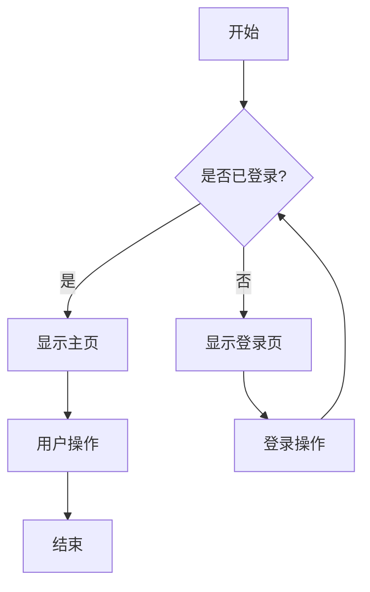
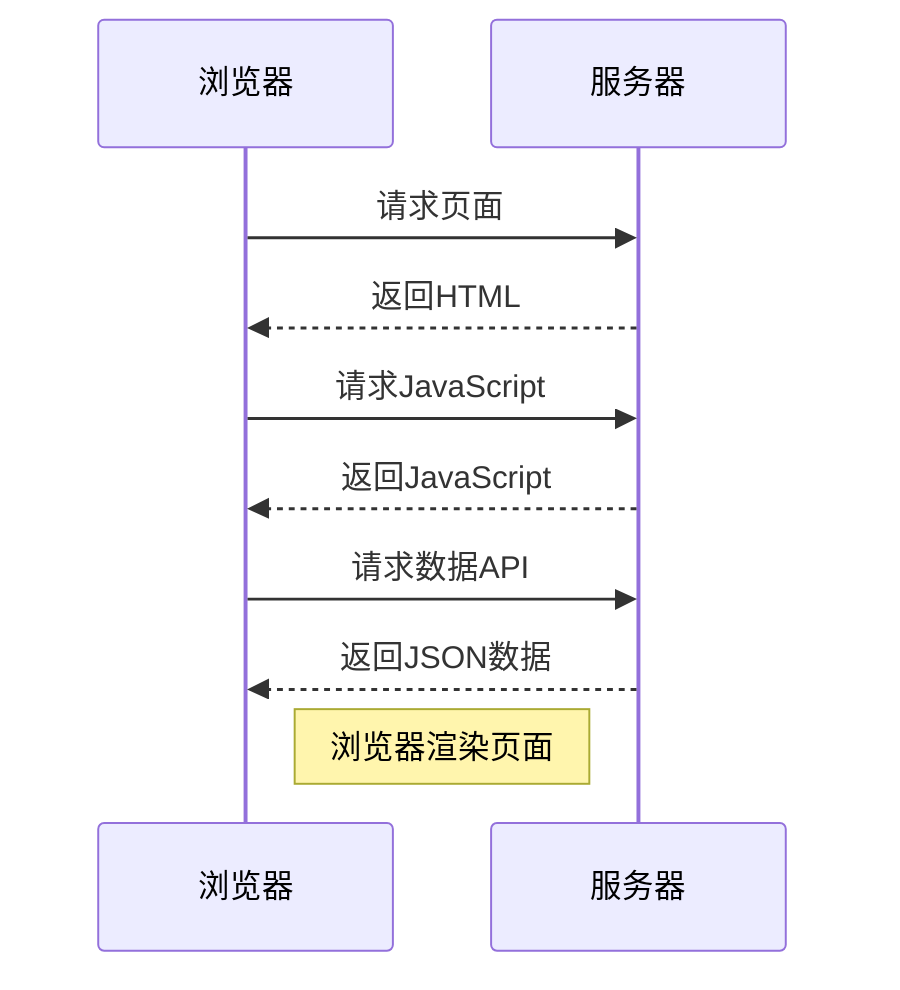
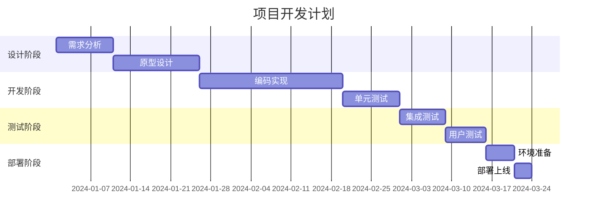
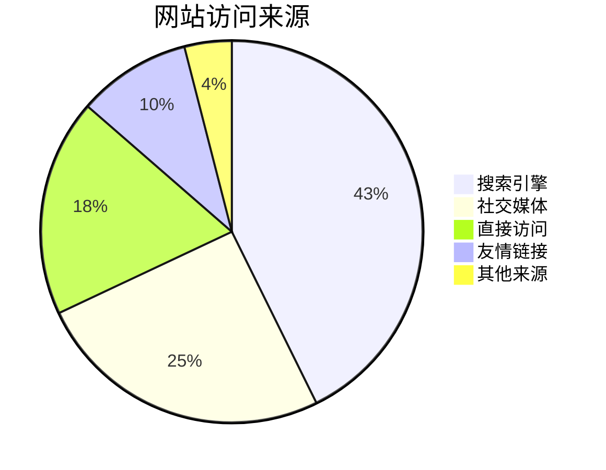
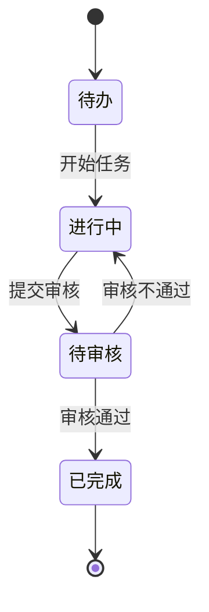
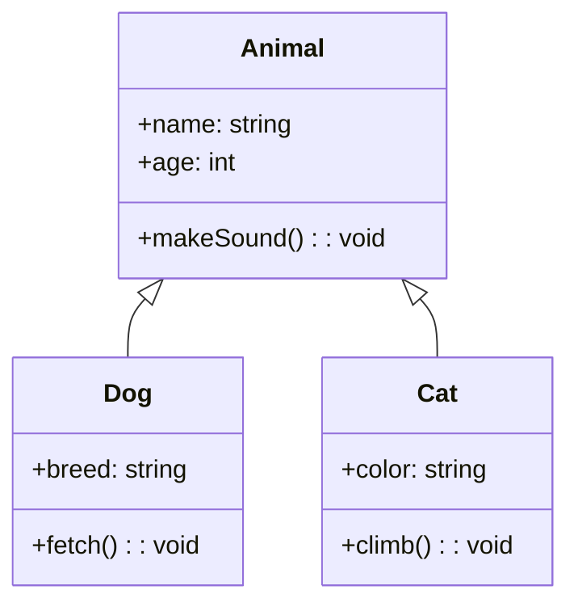
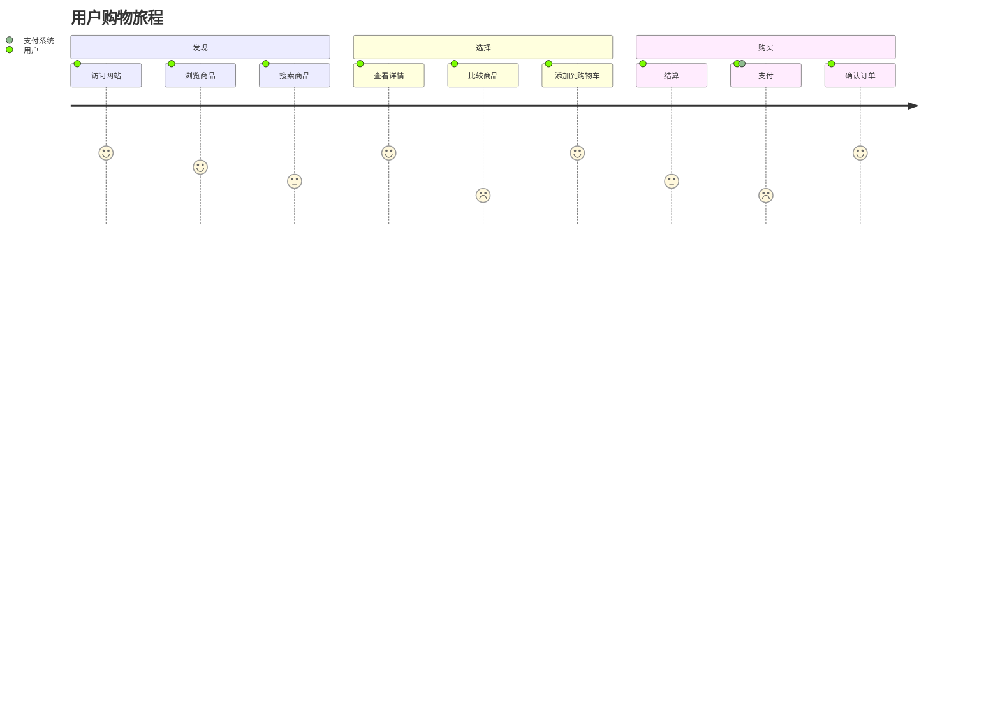

# Markdown 语法

> 测试内容来源：[Typora 的 Markdown 语法](https://support.typoraio.cn/zh/Markdown-Reference/)


## 块元素

### 段落和换行符

段落只是一行或多行连续的文本。在 markdown 源代码中，段落由多个空行分隔。在 Typora 中，您只需按下 `Return` 即可创建新段落。

按 `Shift` + `Return` 可创建单个换行符。但是，大多数 markdown 解析器将忽略单行中断，要使其他 markdown 解析器识别您的换行符，可以在行尾留下两个空格，或者插入 `<br/>`.

### 标题

标题在行的开头使用1-6个＃字符，对应于标题级别1-6。例如：

```markdown
# 一阶标题 或者快捷键Ctrl+1

## 二阶标题 或者快捷键Ctrl+2

### 三阶标题 或者快捷键Ctrl+3

#### 四阶标题 或者快捷键Ctrl+4

##### 五阶标题 或者快捷键Ctrl+5

###### 六阶标题 或者快捷键Ctrl+6
```

在typora中，输入'＃'后跟标题内容，按下 `Return` 键将创建标题。


### 引用文字

Markdown 使用电子邮件样式>字符进行块引用。它们表示为：

```
> 这是一个有两段的块引用。这是第一段。
>
> 这是第二段。Vestibulum enim wisi, viverra nec, fringilla in, laoreet vitae, risus.


> 这是另一个只有一个段落的块引用。有三个空行分隔两个块引用。
```

在 typora 中，只需输入 '>' 后跟引用内容即可生成块引用。Typora 将为您插入正确的 ">" 或换行符。通过添加额外级别的 ">" 允许在块引用内嵌入另一个块引用。

效果如下：

> 这是一个有两段的块引用。这是第一段。
>
> 这是第二段。Vestibulum enim wisi, viverra nec, fringilla in, laoreet vitae, risus.

> 这是另一个只有一个段落的块引用。有三个空行分隔两个块引用。

### 列表

输入 `* list item 1` 将创建一个无序列表，该 `*` 符号可以替换为 `+` 或 `-`.

输入 `1. list item 1` 将创建一个有序列表，其 markdown 源代码如下：

```
## 无序列表
*   红色
*   绿色
*   蓝色

## 有序列表
1.  红色
2. 	绿色
3.	蓝色
```

无序列表：

* 红色
* 绿色
* 蓝色

有序列表：

1. 红色
2. 绿色
3. 蓝色

无顺列表嵌套：

* 颜色
    * 红色
    * 蓝色
    * 白色 

### 任务列表

任务列表是标记为[ ]或[x]（未完成或完成）的项目的列表。例如：

```
- [ ] 这是一个任务列表项
- [ ] 需要在前面使用列表的语法
- [ ] normal **formatting**, @mentions, #1234 refs
- [ ] 未完成
- [x] 完成
```

您可以通过单击项目前面的复选框来更改完成/未完成状态。

- [ ] 这是一个任务列表项
- [ ] 需要在前面使用列表的语法
- [ ] normal **formatting**, @mentions, #1234 refs
- [ ] 未完成
- [x] 完成

### （栅栏式）代码块

Typora仅支持 Github Flavored Markdown 中的栅栏式代码块。不支持 markdown 中的原始代码块。

使用栅栏式代码块很简单：输入 \``` 之后输入一个可选的语言标识符，然后按 `return` 键后输入代码，我们将通过语法高亮显示它：

~~~gfm
这是一个例子：

```
function test() {
  console.log("notice the blank line before this function?");
}
```

语法高亮：
```ruby
require 'redcarpet'
markdown = Redcarpet.new("Hello World!")
puts markdown.to_html
```
~~~

```
function test() {
  console.log("notice the blank line before this function?");
}
```

语法高亮：
```ruby
require 'redcarpet'
markdown = Redcarpet.new("Hello World!")
puts markdown.to_html
```

### 数学公式块

您可以使用 **MathJax** 渲染 *LaTeX* 数学表达式。

输入 `$$`, 然后按 "return"键将触发一个接受*Tex / LaTex*源代码的输入区域。以下是一个例子： 

```latex
$$
\mathbf{V}_1 \times \mathbf{V}_2 =  \begin{vmatrix} 
\mathbf{i} & \mathbf{j} & \mathbf{k} \\
\frac{\partial X}{\partial u} &  \frac{\partial Y}{\partial u} & 0 \\
\frac{\partial X}{\partial v} &  \frac{\partial Y}{\partial v} & 0 \\
\end{vmatrix}
$$
```

在 markdown 源文件中，数学公式块是由 '$$' 标记包装的 *LaTeX* 表达式：

```
$$
\mathbf{V}_1 \times \mathbf{V}_2 =  \begin{vmatrix} 
\mathbf{i} & \mathbf{j} & \mathbf{k} \\
\frac{\partial X}{\partial u} &  \frac{\partial Y}{\partial u} & 0 \\
\frac{\partial X}{\partial v} &  \frac{\partial Y}{\partial v} & 0 \\
\end{vmatrix}
$$
```

### 表格

输入 `| First Header | Second Header |` 并按下 `return` 键将创建一个包含两列的表。

创建表后，焦点在该表上将弹出一个表格工具栏，您可以在其中调整表格，对齐或删除表格。您还可以使用上下文菜单来复制和添加/删除列/行。

可以跳过以下描述，因为表格的 markdown 源代码是由typora自动生成的。

在 markdown 源代码中，它们看起来像这样：

```
| First Header  | Second Header |
| ------------- | ------------- |
| Content Cell  | Content Cell  |
| Content Cell  | Content Cell  |
```

| First Header | Second Header |
| ------------ | ------------- |
| Content Cell | Content Cell  |
| Content Cell | Content Cell  |

您还可以在表格中包括内联 Markdown 语法，例如链接，粗体，斜体或删除线。

最后，通过在标题行中包含冒号：您可以将文本定义为左对齐，右对齐或居中对齐：

```
| Left-Aligned  | Center Aligned  | Right Aligned |
| :------------ |:---------------:| -----:|
| col 3 is      | some wordy text | $1600 |
| col 2 is      | centered        |   $12 |
| zebra stripes | are neat        |    $1 |
```

最左侧的冒号表示左对齐的列; 最右侧的冒号表示右对齐的列; 两侧的冒号表示中心对齐的列。

| Left-Aligned  | Center Aligned  | Right Aligned |
| :------------ | :-------------: | ------------: |
| col 3 is      | some wordy text |         $1600 |
| col 2 is      |    centered     |           $12 |
| zebra stripes |    are neat     |            $1 |

### 脚注

```
您可以像这样创建脚注[^footnote].

[^footnote]: Here is the *text* of the **footnote**.
```

将产生：

您可以像这样创建脚注[1](https://support.typoraio.cn/zh/Markdown-Reference/#fn:footnote).

鼠标移动到 'footnote' 上标中查看脚注的内容。

### 水平线

输入 `***` 或 `---` 在空行上按 `return` 键将绘制一条水平线。

------

### YAML Front Matter

Typora 现在支持 [YAML Front Matter](http://jekyllrb.com/docs/frontmatter/) 。 在文章顶部输入 `---` 然后按 `Enter` 键将引入一个，或者从菜单中插入一个元数据块。

### 目录 (TOC)

输入 `[toc]` 然后按 `Return` 键将创建一个"目录"部分，自动从文档内容中提取所有标题，其内容会自动更新。

### 图表 (Sequence, Flowchart and Mermaid)

Typora 支持, [sequence](https://bramp.github.io/js-sequence-diagrams/), [flowchart](http://flowchart.js.org/) and [mermaid](https://knsv.github.io/mermaid/#mermaid), 使用前要先从偏好设置面板启用该功能。

详细信息请参阅此 [文档](http://support.typora.io/Draw-Diagrams-With-Markdown/)

### 图表示例

以下是几个常用图表的示例，可用于测试渲染器的图表支持情况。

#### 流程图



#### 序列图



#### 甘特图



#### 饼图



#### 状态图



#### 类图



#### 用户旅程图



#### 时间轴图

```