# 技术解析

在企业级应用开发中，缓存系统的设计往往需要在性能、可维护性、扩展性和业务需求之间找到最佳平衡点。Slavopolis Cache 模块作为一个面向企业场景的 Redis 缓存抽象层，其设计哲学体现了对这一平衡的深度思考。本文将深入剖析 Slavopolis Cache 的技术架构、设计决策和实现细节，帮助读者理解其背后的工程智慧，并为类似系统的设计提供参考。

🎯 设计目标：

- **高度抽象**：屏蔽底层 Redis 操作复杂性，提供统一的编程接口
- **企业级特性**：内置缓存穿透保护、异常处理、监控等生产级功能
- **分布式限流**：基于 Redis 的多算法限流实现，支持分布式场景
- **性能优化**：批量操作、连接复用、序列化优化等性能策略
- **可扩展性**：模块化设计，支持自定义扩展和配置
- **Spring 生态集成**：无缝集成 Spring Boot 自动配置机制

📐 架构原则：

1. **关注点分离**：配置、服务、工具各司其职
2. **依赖倒置**：面向接口编程，降低耦合度
3. **开闭原则**：对扩展开放，对修改封闭
4. **单一职责**：每个组件专注特定职责
5. **最小惊讶原则**：API 设计符合开发者直觉

## 🏗️ 架构设计

### 系统架构全览

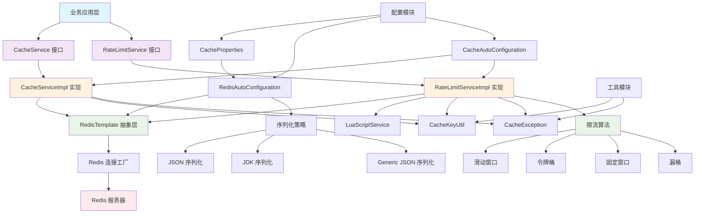

### 模块划分

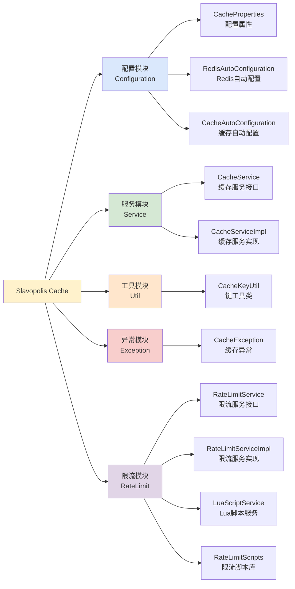

### 数据流转图

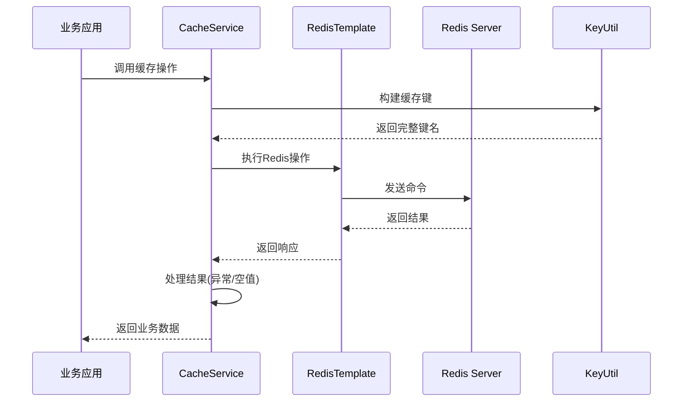

## 🧩 核心组件设计

### 1. 服务层设计

#### CacheService 接口设计

```java
public interface CacheService {
    // 通用操作 - 7个方法
    boolean hasKey(String key);
    boolean delete(String key);
    // ... 其他通用方法
    
    // 字符串操作 - 12个方法
    void set(String key, Object value);
    <T> T get(String key);
    // ... 其他字符串方法
    
    // 哈希操作 - 12个方法
    void hSet(String key, String field, Object value);
    <T> T hGet(String key, String field);
    // ... 其他哈希方法
    
    // 列表操作 - 11个方法
    long lLeftPush(String key, Object... values);
    <T> T lLeftPop(String key);
    // ... 其他列表方法
    
    // 集合操作 - 10个方法
    long sAdd(String key, Object... values);
    <T> Set<T> sMembers(String key);
    // ... 其他集合方法
    
    // 有序集合操作 - 13个方法
    boolean zAdd(String key, Object value, double score);
    <T> Set<T> zRange(String key, long start, long end);
    // ... 其他有序集合方法
    
    // 高级功能 - 3个方法
    <T> T getOrLoad(String key, Function<String, T> loader, Duration duration);
    <T> Map<String, T> batchGetOrLoad(Collection<String> keys, Function<Collection<String>, Map<String, T>> loader, Duration duration);
    <T> T refresh(String key, Function<String, T> loader, Duration duration);
}
```

**设计思路**：

1. **API 分组**：按 Redis 数据结构分组，便于理解和使用
2. **泛型设计**：提供类型安全的方法重载
3. **函数式编程**：高级功能使用 Function 接口，支持懒加载
4. **Duration 支持**：现代 Java 时间 API，替代传统的 TimeUnit

#### CacheServiceImpl 实现架构

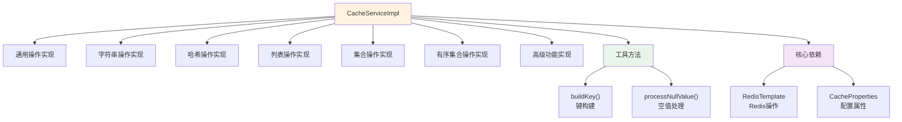

**关键实现特性**：

1. **统一异常处理**：所有方法都包含完整的异常处理逻辑
2. **空值占位符**：使用 `___NULL___` 占位符防止缓存穿透
3. **键前缀管理**：自动添加和处理键前缀
4. **类型安全转换**：提供泛型方法的类型安全实现

### 2. 配置层设计

#### 配置属性层次结构

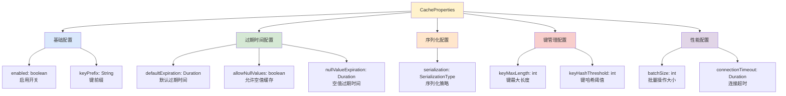

#### 自动配置流程

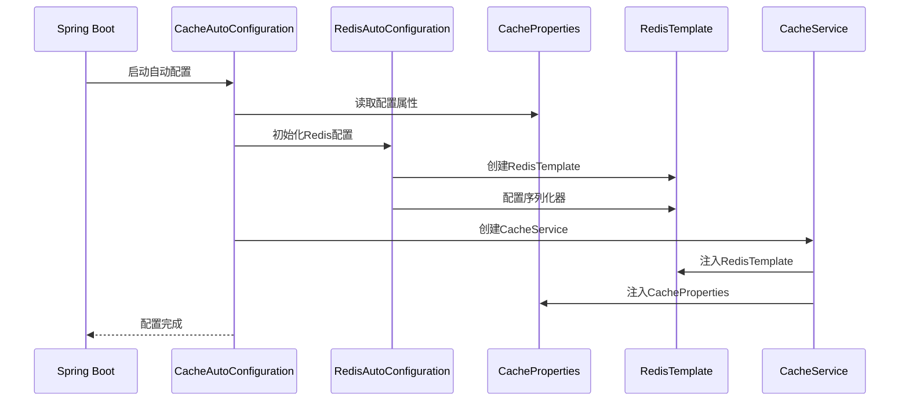

### 3. 工具层设计

#### CacheKeyUtil 设计

```java
public final class CacheKeyUtil {
    // 核心功能
    public static String buildKey(String prefix, Object... parts);
    public static String buildPattern(String prefix, Object... parts);
    public static boolean isValidKey(String key);
    
    // 批量处理
    public static List<String> buildKeys(String prefix, Collection<?> identifiers);
    
    // 键转换
    public static String extractBusinessKey(String key, String prefix);
    
    // 私有工具方法
    private static String normalizeKeyPart(Object part);
    private static String hashKey(String key);
}
```

**设计特性**：

1. **静态工具类**：使用 `@NoArgsConstructor(access = AccessLevel.PRIVATE)` 防止实例化
2. **键长度管理**：超过阈值的键会自动进行 MD5 哈希
3. **非法字符处理**：自动处理空格、换行等非法字符
4. **批量操作支持**：提供批量键构建方法

#### 键构建流程

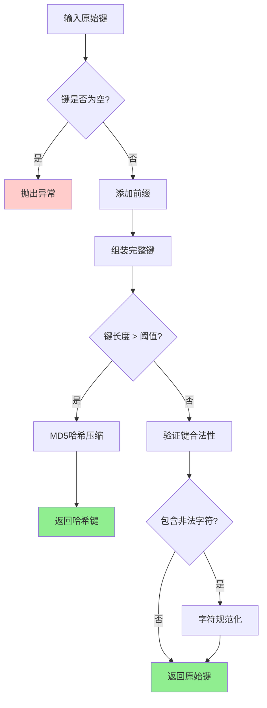

## 🚀 核心技术解析

### 1. 缓存穿透保护机制

#### 空值占位符策略

```java
// 空值占位符常量
private static final String NULL_VALUE_PLACEHOLDER = "___NULL___";

// 空值处理方法
private <T> T processNullValue(Object value) {
    if (NULL_VALUE_PLACEHOLDER.equals(value)) {
        return null;
    }
    return (T) value;
}
```

#### getOrLoad 实现流程

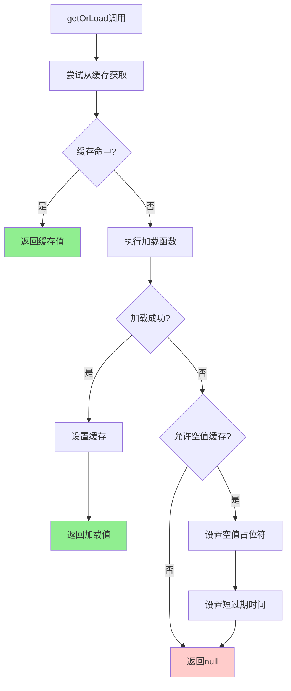

**技术要点**：

1. **缓存穿透防护**：对于 null 值，设置特殊占位符并缓存较短时间
2. **异常降级**：缓存异常时直接调用加载函数，保证业务不中断
3. **配置驱动**：通过 `allowNullValues` 控制是否缓存空值

### 2. 批量操作优化

#### batchGetOrLoad 复杂度优化

**重构前问题**：
- 方法认知复杂度达到 33，超过 SonarQube 建议的 15
- 单一方法承担过多职责
- 代码可读性和维护性差

**重构后架构**：

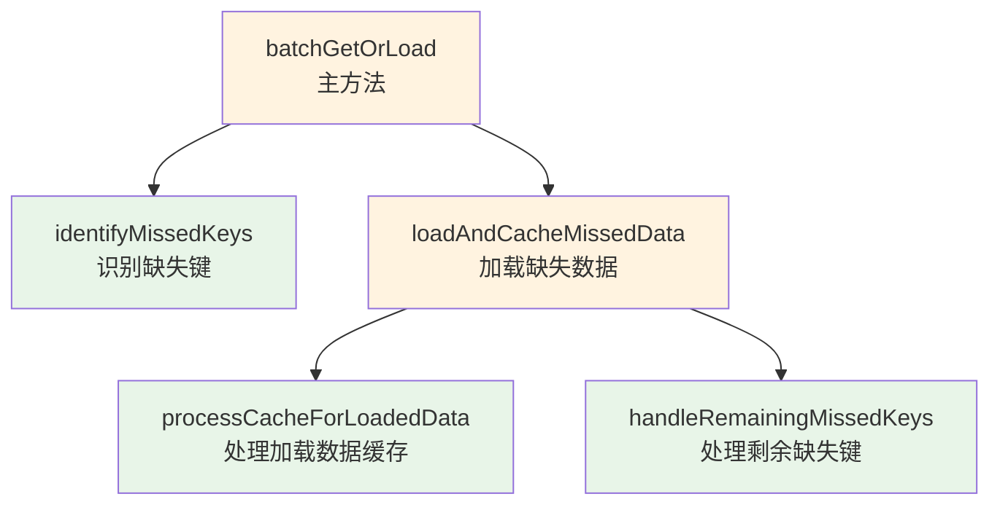

**优化效果**：
- 主方法复杂度降低到 5
- 每个子方法职责单一，便于测试
- 代码可读性大幅提升

### 3. 序列化策略设计

#### 多策略支持架构

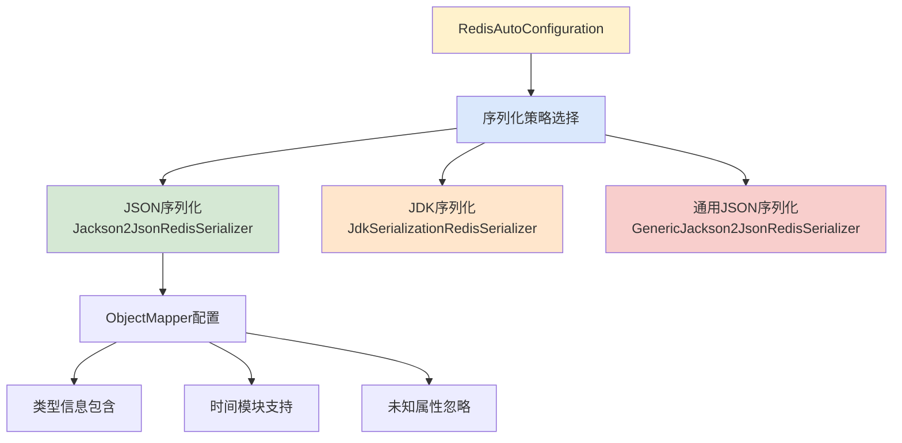

#### JSON 序列化配置详解

```java
private ObjectMapper createObjectMapper() {
    ObjectMapper objectMapper = new ObjectMapper();
    
    // 设置可见性 - 支持所有字段序列化
    objectMapper.setVisibility(PropertyAccessor.ALL, JsonAutoDetect.Visibility.ANY);
    
    // 启用类型信息 - 解决多态序列化问题
    objectMapper.activateDefaultTyping(
        LaissezFaireSubTypeValidator.instance,
        ObjectMapper.DefaultTyping.NON_FINAL,
        JsonTypeInfo.As.PROPERTY
    );
    
    // Java 8 时间支持
    objectMapper.registerModule(new JavaTimeModule());
    objectMapper.disable(SerializationFeature.WRITE_DATES_AS_TIMESTAMPS);
    
    // 容错配置
    objectMapper.disable(DeserializationFeature.FAIL_ON_UNKNOWN_PROPERTIES);
    
    return objectMapper;
}
```

**技术特性**：

1. **类型信息保存**：序列化时包含类型信息，支持多态对象
2. **时间类型支持**：原生支持 Java 8 时间 API
3. **容错性**：忽略未知属性，增强版本兼容性
4. **性能优化**：使用高效的 Jackson 库

### 4. 异常处理机制

#### 统一异常处理模式

```java
public void set(String key, Object value) {
    try {
        String finalKey = buildKey(key);
        redisTemplate.opsForValue().set(finalKey, value);
    } catch (Exception e) {
        log.error("设置缓存失败，key: {}", key, e);
        throw new CacheException("设置缓存失败", e);
    }
}
```

#### 异常处理流程

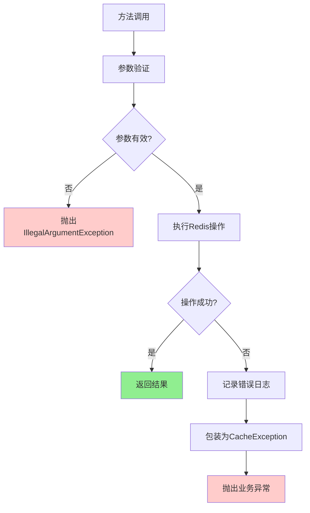

**设计原则**：

1. **快速失败**：参数错误立即抛出异常
2. **异常转换**：将底层异常转换为业务异常
3. **日志记录**：详细记录异常信息，便于排查
4. **上下文保留**：保留原始异常信息

### 5. 分布式限流系统

#### 限流架构设计

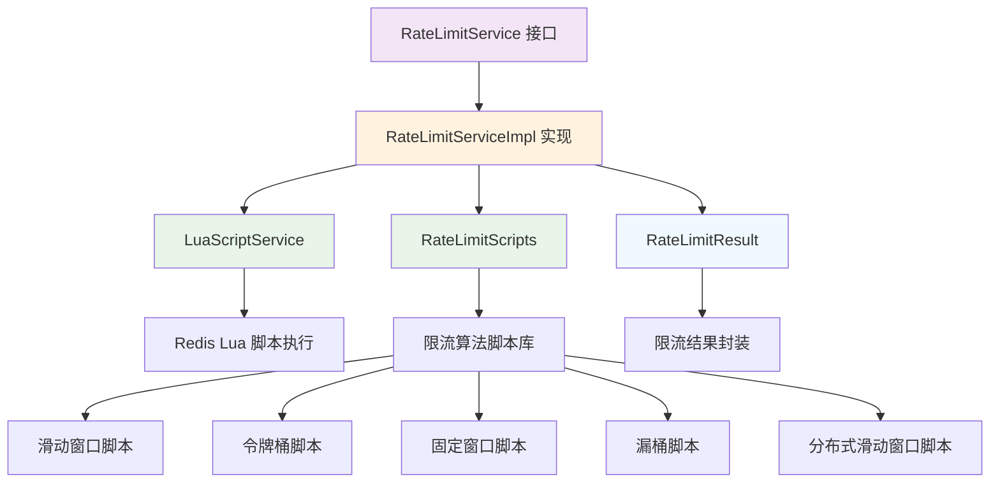

#### 核心限流算法实现

##### 1. 滑动窗口算法

**算法原理**：
- 维护一个时间窗口，记录窗口内的请求时间戳
- 每次请求时清理过期的时间戳，检查当前窗口内请求数量
- 相比固定窗口，能更平滑地控制流量

**技术特点**：
- **精确控制**：严格按照时间窗口计算请求数量
- **内存优化**：自动清理过期数据，避免内存泄漏
- **原子操作**：Lua 脚本保证操作的原子性

##### 2. 令牌桶算法

**算法原理**：
- 以固定速率向桶中添加令牌
- 请求时从桶中消耗令牌
- 桶满时停止添加令牌，允许突发流量

**技术特点**：
- **突发支持**：允许短时间内的流量突发
- **平滑补充**：按固定速率补充令牌
- **状态持久化**：桶状态持久化到 Redis

##### 3. 分布式滑动窗口算法

**算法原理**：
- 结合全局限流和实例限流
- 全局窗口控制总体流量
- 实例窗口防止单实例占用过多配额

**技术特点**：
- **全局协调**：多实例间协调限流
- **公平分配**：防止单实例占用过多配额
- **故障隔离**：实例故障不影响其他实例

#### Lua 脚本服务设计

```java
@Service
public class LuaScriptServiceImpl implements LuaScriptService {
    
    private final RedisTemplate<String, Object> redisTemplate;
    
    /**
     * 脚本SHA缓存
     */
    private final Map<String, String> scriptShaCache = new ConcurrentHashMap<>();
    
    @Override
    public <T> T execute(String script, Class<T> resultType, List<String> keys, Object... args) {
        try {
            return redisTemplate.execute((RedisCallback<T>) connection -> {
                // 尝试使用缓存的SHA
                String sha = scriptShaCache.get(script);
                if (sha != null && existsScript(sha)) {
                    return executeByScriptSha(sha, resultType, keys, args);
                }
                
                // 加载脚本并缓存SHA
                sha = loadScript(script);
                scriptShaCache.put(script, sha);
                
                return executeByScriptSha(sha, resultType, keys, args);
            });
        } catch (Exception e) {
            log.error("执行Lua脚本失败", e);
            throw new CacheException("执行Lua脚本失败", e);
        }
    }
}
```

**技术特点**：
- **脚本缓存**：缓存脚本SHA，避免重复加载
- **原子执行**：Lua脚本保证操作原子性
- **异常处理**：完善的异常处理和日志记录
- **类型安全**：泛型方法提供类型安全

#### 限流预热机制

限流预热使用指数增长算法，在系统启动初期使用较低的限流阈值，随着系统运行时间增长，逐渐提升到正常阈值：

```java
// 指数预热公式：coldThreshold + (normalThreshold - coldThreshold) * progress^2
long currentThreshold = Math.round(coldThreshold + 
    (normalThreshold - coldThreshold) * Math.pow(warmupProgress, 2));
```

**预热算法特点**：
- **指数增长**：使用二次函数实现平滑的阈值提升
- **冷启动保护**：系统启动初期使用较低的限流阈值
- **异常降级**：计算异常时使用保守阈值

## 🔧 性能优化策略

### 1. 连接管理优化

#### 连接池配置

```yaml
spring:
  redis:
    lettuce:
      pool:
        max-active: 10      # 最大活跃连接数
        max-idle: 8         # 最大空闲连接数
        min-idle: 2         # 最小空闲连接数
        max-wait: 2000ms    # 最大等待时间
```

#### 连接复用策略

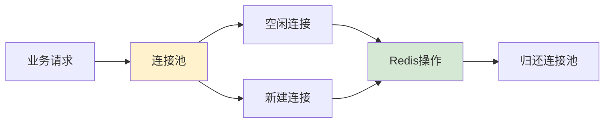

### 2. 批量操作优化

#### Pipeline 模式应用

```java
// 批量设置优化
public void multiSet(Map<String, Object> map) {
    if (CollectionUtils.isEmpty(map)) {
        return;
    }
    
    try {
        Map<String, Object> finalMap = map.entrySet().stream()
                .collect(Collectors.toMap(
                        entry -> buildKey(entry.getKey()),
                        Map.Entry::getValue
                ));
        
        // 使用Redis Pipeline 批量操作
        redisTemplate.opsForValue().multiSet(finalMap);
    } catch (Exception e) {
        log.error("批量设置缓存失败", e);
        throw new CacheException("批量设置缓存失败", e);
    }
}
```

### 3. 内存优化

#### 键长度控制

```java
private static String hashKey(String key) {
    try {
        MessageDigest md = MessageDigest.getInstance(CommonConstants.MD5_ALGORITHM);
        byte[] hashBytes = md.digest(key.getBytes());
        
        StringBuilder sb = new StringBuilder();
        for (byte b : hashBytes) {
            sb.append(String.format("%02x", b));
        }
        
        return sb.toString();
    } catch (NoSuchAlgorithmException e) {
        throw new CacheException("Failed to hash cache key", e);
    }
}
```

#### 内存使用优化策略

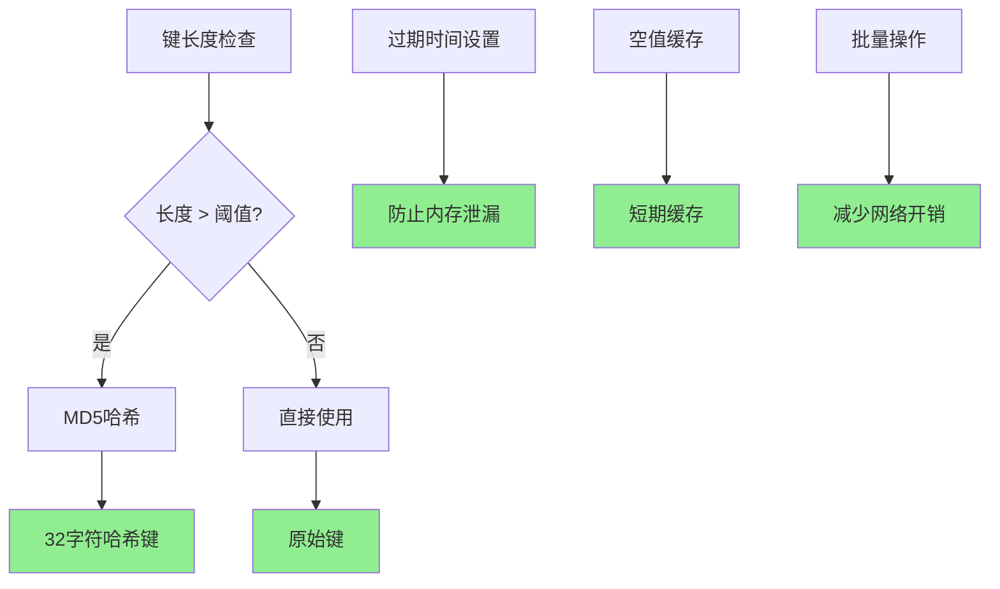

## 🔐 安全性设计

### 1. 键安全策略

#### 键前缀隔离

```java
public String buildKey(String prefix, Object... parts) {
    if (!StringUtils.hasText(prefix)) {
        throw new IllegalArgumentException("键前缀不能为空");
    }
    
    StringBuilder keyBuilder = new StringBuilder(prefix);
    
    if (parts != null) {
        for (Object part : parts) {
            if (part != null) {
                if (!keyBuilder.isEmpty()) {
                    keyBuilder.append(CommonConstants.CACHE_KEY_SEPARATOR);
                }
                keyBuilder.append(normalizeKeyPart(part));
            }
        }
    }
    
    return keyBuilder.toString();
}
```

#### 键验证机制

```java
public static boolean isValidKey(String key) {
    if (!StringUtils.hasText(key)) {
        return false;
    }
    
    // 检查键长度
    if (key.length() > MAX_KEY_LENGTH) {
        return false;
    }
    
    // 检查非法字符
    return !key.contains(CommonConstants.SPACE) &&
           !key.contains(CommonConstants.NEW_LINE) &&
           !key.contains(CommonConstants.CARRIAGE_RETURN) &&
           !key.contains(CommonConstants.TAB);
}
```

### 2. 数据安全

#### 序列化安全

```java
// 类型安全的反序列化
@SuppressWarnings("unchecked")
public <T> T get(String key, Class<T> type) {
    try {
        Object value = get(key);
        if (value == null) {
            return null;
        }
        
        if (type.isInstance(value)) {
            return (T) value;
        }
        
        // 类型不匹配时的安全处理
        log.warn("缓存值类型不匹配，key: {}, expected: {}, actual: {}", 
                 key, type.getName(), value.getClass().getName());
        return null;
    } catch (Exception e) {
        log.error("获取缓存失败，key: {}, type: {}", key, type.getName(), e);
        throw new CacheException("获取缓存失败", e);
    }
}
```

## 📊 监控与可观测性

### 1. 日志体系

#### 分层日志设计

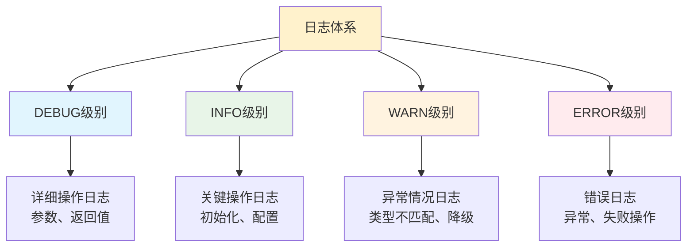

#### 日志配置示例

```yaml
logging:
  level:
    club.slavopolis.cache: DEBUG
    org.springframework.data.redis: INFO
  pattern:
    file: "[%d{yyyy-MM-dd HH:mm:ss.SSS}] [%thread] %-5level %logger{50} - %msg%n"
```

### 2. 性能监控

#### 关键指标监控

```java
// 在实际实现中可以添加监控埋点
@Override
public <T> T get(String key) {
    long startTime = System.currentTimeMillis();
    try {
        String finalKey = buildKey(key);
        Object value = redisTemplate.opsForValue().get(finalKey);
        
        // 监控埋点：命中率统计
        recordCacheHit(key, value != null);
        
        return processNullValue(value);
    } catch (Exception e) {
        // 监控埋点：错误率统计
        recordCacheError(key, e);
        
        log.error("获取缓存失败，key: {}", key, e);
        throw new CacheException("获取缓存失败", e);
    } finally {
        // 监控埋点：响应时间统计
        long duration = System.currentTimeMillis() - startTime;
        recordCacheLatency(key, duration);
    }
}
```

## 🚀 扩展性设计

### 1. 插件化架构

#### 扩展点设计

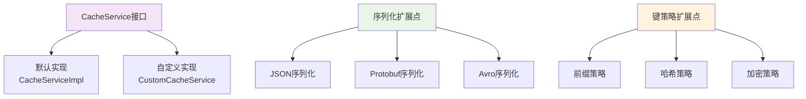

### 2. 配置扩展

#### 自定义配置支持

```java
@Configuration
@ConditionalOnProperty(prefix = "slavopolis.cache.custom", name = "enabled", havingValue = "true")
public class CustomCacheConfiguration {
    
    @Bean
    @ConditionalOnMissingBean
    public CacheService customCacheService(RedisTemplate<String, Object> redisTemplate, 
                                         CacheProperties cacheProperties) {
        return new CustomCacheServiceImpl(redisTemplate, cacheProperties);
    }
    
    @Bean("customRedisTemplate")
    public RedisTemplate<String, Object> customRedisTemplate(RedisConnectionFactory connectionFactory) {
        // 自定义 RedisTemplate 配置
        return createCustomRedisTemplate(connectionFactory);
    }
}
```

## 🏆 最佳实践总结

### 1. 架构设计最佳实践

1. **接口抽象**：通过接口定义契约，实现类专注实现
2. **配置外化**：所有可变参数通过配置文件管理
3. **异常统一**：建立统一的异常处理和转换机制
4. **日志规范**：分层次、有结构的日志记录
5. **性能优化**：批量操作、连接复用、内存管理

### 2. 代码质量最佳实践

1. **SonarQube 规范**：严格遵循代码质量规范
2. **认知复杂度控制**：单一方法复杂度不超过 15
3. **泛型安全**：提供类型安全的 API 设计
4. **空值处理**：完善的 null 值处理机制
5. **测试覆盖**：核心逻辑 80%+ 测试覆盖率

### 3. 企业级特性

1. **缓存穿透保护**：空值占位符 + 短期缓存
2. **分布式限流**：多算法限流，支持分布式场景
3. **故障降级**：缓存异常时直接调用数据源
4. **监控友好**：丰富的日志和监控埋点
5. **配置灵活**：支持多环境配置
6. **扩展性强**：插件化架构，易于扩展

## 🔮 技术演进方向

### 1. 功能增强

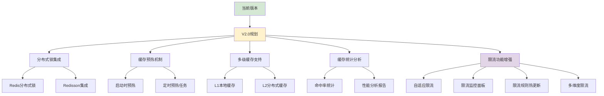

### 2. 性能优化

1. **本地缓存集成**：L1 + L2 多级缓存架构
2. **异步操作支持**：响应式编程模型
3. **批量操作优化**：Pipeline 和 Lua 脚本
4. **连接池优化**：动态连接池管理
5. **序列化优化**：支持更多高效序列化协议
6. **限流性能优化**：
   - **脚本预编译**：Lua 脚本预编译和缓存优化
   - **内存优化**：限流数据结构内存使用优化
   - **批量限流**：支持批量限流检查，减少网络开销
   - **本地限流**：结合本地限流减少 Redis 访问

### 3. 运维增强

1. **健康检查**：Redis 连接状态监控
2. **指标暴露**：Prometheus 指标集成
3. **故障恢复**：自动重连和故障转移
4. **配置热更新**：运行时配置变更
5. **可视化界面**：缓存管理控制台
6. **限流运维功能**：
   - **限流监控**：实时限流状态监控和告警
   - **限流分析**：限流效果分析和报告生成
   - **动态调整**：运行时动态调整限流参数
   - **限流审计**：限流操作审计日志和追踪

## 📝 总结

Slavopolis Cache 模块通过精心的架构设计和工程实践，为企业级应用提供了一个功能完备、性能优异、易于使用的 Redis 缓存抽象层。其设计哲学体现了以下几个方面的平衡：

### 🎯 技术价值

1. **抽象性 vs 性能**：在提供高度抽象的同时，保持了接近原生 Redis 的性能
2. **易用性 vs 灵活性**：简化了 API 使用，同时保留了足够的扩展空间
3. **功能性 vs 复杂度**：丰富的功能特性，但保持了代码的可维护性
4. **标准化 vs 定制化**：遵循业界标准，同时支持企业级定制需求

### 🔧 工程智慧

1. **关注点分离**：清晰的模块划分和职责边界
2. **防御式编程**：完善的异常处理和边界条件处理
3. **性能优化**：多个层面的性能优化策略
4. **可观测性**：丰富的日志和监控支持

### 🚀 发展前景

作为一个企业级基础设施组件，Slavopolis Cache 具有良好的发展前景：

1. **生态集成**：与 Spring 生态深度集成，符合主流技术趋势
2. **标准遵循**：遵循业界最佳实践，易于推广应用
3. **扩展能力**：模块化架构，支持持续演进
4. **社区友好**：开源友好的设计，便于社区贡献

通过本技术解析，希望能帮助读者深入理解 Slavopolis Cache 的设计思路和实现细节，并在类似系统的设计中获得启发和参考。在企业级应用开发中，这样的基础设施组件往往是系统稳定性和开发效率的重要保障。

## 📚 参考资料

- [Redis 官方文档](https://redis.io/documentation)
- [Spring Data Redis 参考指南](https://docs.spring.io/spring-data/redis/docs/current/reference/html/)
- [Jackson 序列化最佳实践](https://github.com/FasterXML/jackson-docs)
- [SonarQube Java 规则](https://rules.sonarsource.com/java/)
- [阿里巴巴 Java 开发手册](https://github.com/alibaba/p3c) 
