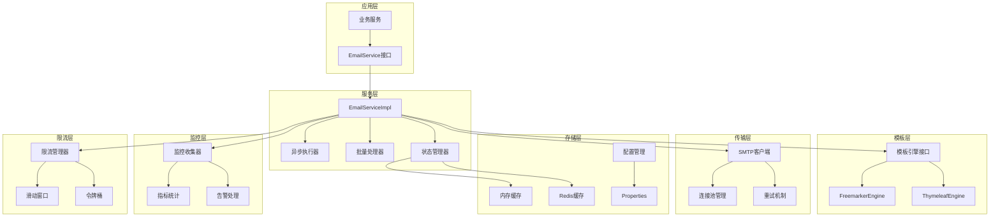

# 技术解析

在企业级应用开发中，邮件服务往往被视为一个简单的功能模块，但实际上，一个高质量的邮件服务需要考虑性能、可靠性、可扩展性、监控等多个维度。Slavopolis Email 模块正是基于这些企业级需求而精心设计的邮件服务解决方案。

本文将深入剖析 Slavopolis Email 的技术架构、设计思路和实现细节，帮助开发者理解其背后的技术原理，并为类似系统的设计提供参考。

## 🎯 设计目标与原则

### 核心设计目标

**1. 开箱即用的简洁性**

- 零配置启动，自动装配所有必要组件
- 提供合理的默认配置，降低使用门槛
- 统一的API接口，屏蔽底层复杂性

**2. 企业级的可靠性**
- 完善的异常处理和重试机制
- 分布式环境下的状态一致性
- 故障隔离和降级策略

**3. 高性能的处理能力**
- 异步非阻塞的发送机制
- 批量处理和连接池优化
- 智能的限流和背压控制

**4. 灵活的扩展性**
- 插件化的模板引擎支持
- 可配置的发送策略
- 开放的监控和统计接口

### 设计原则

**单一职责原则（SRP）**
- 每个组件专注于特定的功能领域
- 邮件发送、模板渲染、状态管理等职责分离
- 清晰的接口边界和依赖关系

**开闭原则（OCP）**
- 对扩展开放，对修改封闭
- 通过策略模式支持多种发送策略
- 通过工厂模式支持多种模板引擎

**依赖倒置原则（DIP）**
- 依赖抽象而非具体实现
- 通过接口定义核心契约
- 便于单元测试和模块替换

**最小惊讶原则**
- API设计符合开发者直觉
- 配置项命名清晰明确
- 错误信息详细且可操作

## 🏗️ 系统架构设计

### 整体架构图



### 模块划分

**应用层（Application Layer）**
- 提供统一的邮件服务接口
- 封装业务逻辑，屏蔽技术细节
- 支持同步和异步调用模式

**服务层（Service Layer）**
- 核心业务逻辑实现
- 异步任务调度和管理
- 批量处理优化
- 发送状态管理

**模板层（Template Layer）**
- 多模板引擎支持（Freemarker/Thymeleaf）
- 模板缓存和预编译
- 动态内容渲染

**传输层（Transport Layer）**
- SMTP协议实现
- 连接池管理
- 重试和故障恢复

**存储层（Storage Layer）**
- 多级缓存策略
- 配置管理
- 状态持久化

**监控层（Monitor Layer）**
- 指标收集和统计
- 性能监控
- 告警处理

**限流层（Rate Limit Layer）**
- 多维度限流策略
- 动态阈值调整
- 背压控制

## 🔧 核心技术实现

### 1. 异步发送架构

#### 异步执行器设计

```java
@Component
public class EmailAsyncExecutor {
    
    private final ThreadPoolTaskExecutor executor;
    private final EmailSendResultCache resultCache;
    
    public EmailAsyncExecutor(EmailProperties properties) {
        this.executor = createExecutor(properties.getSendStrategy());
        this.resultCache = new EmailSendResultCache();
    }
    
    public CompletableFuture<EmailSendResult> executeAsync(EmailMessage message) {
        return CompletableFuture.supplyAsync(() -> {
            try {
                // 执行发送逻辑
                EmailSendResult result = doSendEmail(message);
                
                // 缓存结果
                resultCache.put(message.getMessageId(), result);
                
                return result;
            } catch (Exception e) {
                EmailSendResult errorResult = EmailSendResult.failure(
                    message.getMessageId(), 
                    EmailErrorCode.SEND_FAILED, 
                    e.getMessage()
                );
                resultCache.put(message.getMessageId(), errorResult);
                return errorResult;
            }
        }, executor);
    }
    
    private ThreadPoolTaskExecutor createExecutor(SendStrategy strategy) {
        ThreadPoolTaskExecutor executor = new ThreadPoolTaskExecutor();
        executor.setCorePoolSize(strategy.getAsyncPoolSize());
        executor.setMaxPoolSize(strategy.getAsyncPoolSize() * 2);
        executor.setQueueCapacity(strategy.getAsyncQueueSize());
        executor.setThreadNamePrefix("email-async-");
        executor.setRejectedExecutionHandler(new ThreadPoolExecutor.CallerRunsPolicy());
        executor.initialize();
        return executor;
    }
}
```

#### 批量处理优化

```java
@Component
public class EmailBatchProcessor {
    
    private final EmailSender emailSender;
    private final EmailProperties properties;
    
    public List<EmailSendResult> processBatch(List<EmailMessage> messages) {
        int batchSize = properties.getSendStrategy().getBatchSize();
        long batchInterval = properties.getSendStrategy().getBatchInterval();
        
        List<EmailSendResult> results = new ArrayList<>();
        
        // 分批处理
        for (int i = 0; i < messages.size(); i += batchSize) {
            List<EmailMessage> batch = messages.subList(
                i, Math.min(i + batchSize, messages.size())
            );
            
            // 批量发送
            List<EmailSendResult> batchResults = sendBatch(batch);
            results.addAll(batchResults);
            
            // 批次间延迟
            if (i + batchSize < messages.size()) {
                try {
                    Thread.sleep(batchInterval);
                } catch (InterruptedException e) {
                    Thread.currentThread().interrupt();
                    break;
                }
            }
        }
        
        return results;
    }
    
    private List<EmailSendResult> sendBatch(List<EmailMessage> batch) {
        return batch.parallelStream()
            .map(this::sendSingleEmail)
            .collect(Collectors.toList());
    }
    
    private EmailSendResult sendSingleEmail(EmailMessage message) {
        try {
            return emailSender.send(message);
        } catch (Exception e) {
            return EmailSendResult.failure(
                message.getMessageId(),
                EmailErrorCode.SEND_FAILED,
                e.getMessage()
            );
        }
    }
}
```

### 2. 模板引擎架构

#### 模板引擎抽象

```java
public interface EmailTemplateEngine {
    
    /**
     * 渲染模板
     */
    String render(String templateName, Map<String, Object> params) throws TemplateException;
    
    /**
     * 预编译模板
     */
    void precompile(String templateName) throws TemplateException;
    
    /**
     * 清除模板缓存
     */
    void clearCache();
    
    /**
     * 获取引擎类型
     */
    TemplateEngine getEngineType();
}
```

#### Freemarker引擎实现

```java
@Component
@ConditionalOnProperty(name = "slavopolis.email.template.engine", havingValue = "FREEMARKER")
public class FreemarkerEmailTemplateEngine implements EmailTemplateEngine {
    
    private final Configuration freemarkerConfig;
    private final Map<String, Template> templateCache;
    private final EmailProperties.TemplateConfig templateConfig;
    
    public FreemarkerEmailTemplateEngine(EmailProperties properties) {
        this.templateConfig = properties.getTemplate();
        this.templateCache = new ConcurrentHashMap<>();
        this.freemarkerConfig = createFreemarkerConfiguration();
    }
    
    @Override
    public String render(String templateName, Map<String, Object> params) throws TemplateException {
        try {
            Template template = getTemplate(templateName);
            StringWriter writer = new StringWriter();
            template.process(params, writer);
            return writer.toString();
        } catch (Exception e) {
            throw new TemplateException("模板渲染失败: " + templateName, e);
        }
    }
    
    private Template getTemplate(String templateName) throws IOException {
        if (templateConfig.isCacheEnabled()) {
            return templateCache.computeIfAbsent(templateName, this::loadTemplate);
        } else {
            return loadTemplate(templateName);
        }
    }
    
    private Template loadTemplate(String templateName) {
        try {
            String templatePath = templateName + templateConfig.getTemplateSuffix();
            return freemarkerConfig.getTemplate(templatePath);
        } catch (IOException e) {
            throw new TemplateException("模板加载失败: " + templateName, e);
        }
    }
    
    private Configuration createFreemarkerConfiguration() {
        Configuration config = new Configuration(Configuration.VERSION_2_3_31);
        
        // 设置模板加载器
        try {
            String templatePath = templateConfig.getTemplatePath();
            if (templatePath.startsWith("classpath:")) {
                config.setClassLoaderForTemplateLoading(
                    getClass().getClassLoader(),
                    templatePath.substring("classpath:".length())
                );
            } else {
                config.setDirectoryForTemplateLoading(new File(templatePath));
            }
        } catch (IOException e) {
            throw new EmailConfigurationException("Freemarker配置失败", e);
        }
        
        // 设置编码
        config.setDefaultEncoding(templateConfig.getEncoding());
        
        // 设置异常处理
        config.setTemplateExceptionHandler(TemplateExceptionHandler.RETHROW_HANDLER);
        
        // 设置数字格式
        config.setNumberFormat("0.######");
        
        return config;
    }
}
```

### 3. 限流系统设计

#### 限流管理器

```java
@Component
public class EmailRateLimitManager {
    
    private final Map<String, RateLimiter> limiters;
    private final EmailProperties.RateLimit rateLimitConfig;
    private final RedisTemplate<String, String> redisTemplate;
    
    public EmailRateLimitManager(EmailProperties properties, 
                                RedisTemplate<String, String> redisTemplate) {
        this.rateLimitConfig = properties.getRateLimit();
        this.redisTemplate = redisTemplate;
        this.limiters = new ConcurrentHashMap<>();
        
        initializeLimiters();
    }
    
    public boolean tryAcquire(EmailMessage message) {
        if (!rateLimitConfig.isEnabled()) {
            return true;
        }
        
        List<String> limitKeys = buildLimitKeys(message);
        
        for (String key : limitKeys) {
            RateLimiter limiter = limiters.get(key);
            if (limiter != null && !limiter.tryAcquire()) {
                if (rateLimitConfig.isFailOnLimitError()) {
                    throw new EmailRateLimitException("邮件发送频率超限: " + key);
                }
                return false;
            }
        }
        
        return true;
    }
    
    private List<String> buildLimitKeys(EmailMessage message) {
        List<String> keys = new ArrayList<>();
        
        // 全局限流
        keys.add("global");
        
        // 按发送方限流
        if (rateLimitConfig.isPerSender()) {
            keys.add("sender:" + message.getFrom());
        }
        
        // 按收件人限流
        if (rateLimitConfig.isPerRecipient()) {
            message.getTo().forEach(recipient -> 
                keys.add("recipient:" + recipient));
        }
        
        // 按业务标签限流
        if (rateLimitConfig.isPerBusinessTag() && message.getBusinessTag() != null) {
            keys.add("business:" + message.getBusinessTag());
        }
        
        return keys;
    }
    
    private void initializeLimiters() {
        // 全局限流器
        limiters.put("global", RateLimiter.create(
            rateLimitConfig.getMaxSendPerSecond()));
        
        // 其他限流器根据需要动态创建
    }
}
```

#### 滑动窗口限流实现

```java
@Component
public class SlidingWindowRateLimiter {
    
    private final RedisTemplate<String, String> redisTemplate;
    private final String luaScript;
    
    public SlidingWindowRateLimiter(RedisTemplate<String, String> redisTemplate) {
        this.redisTemplate = redisTemplate;
        this.luaScript = loadLuaScript();
    }
    
    public boolean tryAcquire(String key, int maxRequests, Duration window) {
        long windowSizeMs = window.toMillis();
        long currentTime = System.currentTimeMillis();
        
        List<String> keys = Collections.singletonList(key);
        Object[] args = {
            String.valueOf(currentTime),
            String.valueOf(windowSizeMs),
            String.valueOf(maxRequests)
        };
        
        Long result = redisTemplate.execute(
            RedisScript.of(luaScript, Long.class),
            keys,
            args
        );
        
        return result != null && result == 1;
    }
    
    private String loadLuaScript() {
        return """
            local key = KEYS[1]
            local currentTime = tonumber(ARGV[1])
            local windowSize = tonumber(ARGV[2])
            local maxRequests = tonumber(ARGV[3])
            
            local windowStart = currentTime - windowSize
            
            -- 清理过期记录
            redis.call('ZREMRANGEBYSCORE', key, 0, windowStart)
            
            -- 获取当前窗口内的请求数
            local currentCount = redis.call('ZCARD', key)
            
            if currentCount < maxRequests then
                -- 添加当前请求
                redis.call('ZADD', key, currentTime, currentTime)
                redis.call('EXPIRE', key, math.ceil(windowSize / 1000))
                return 1
            else
                return 0
            end
            """;
    }
}
```

### 4. 状态管理系统

#### 发送结果缓存

```java
@Component
public class EmailSendResultCache {
    
    private final Cache<String, EmailSendResult> localCache;
    private final RedisTemplate<String, EmailSendResult> redisTemplate;
    private final boolean useRedis;
    
    public EmailSendResultCache(EmailProperties properties,
                               @Autowired(required = false) RedisTemplate<String, EmailSendResult> redisTemplate) {
        this.useRedis = properties.isUseRedisCacheForResults() && redisTemplate != null;
        this.redisTemplate = redisTemplate;
        this.localCache = createLocalCache();
    }
    
    public void put(String messageId, EmailSendResult result) {
        // 本地缓存
        localCache.put(messageId, result);
        
        // Redis缓存（如果启用）
        if (useRedis) {
            try {
                redisTemplate.opsForValue().set(
                    buildRedisKey(messageId), 
                    result, 
                    Duration.ofHours(24)
                );
            } catch (Exception e) {
                log.warn("Redis缓存写入失败: {}", e.getMessage());
            }
        }
    }
    
    public EmailSendResult get(String messageId) {
        // 先查本地缓存
        EmailSendResult result = localCache.getIfPresent(messageId);
        if (result != null) {
            return result;
        }
        
        // 再查Redis缓存
        if (useRedis) {
            try {
                result = redisTemplate.opsForValue().get(buildRedisKey(messageId));
                if (result != null) {
                    // 回写本地缓存
                    localCache.put(messageId, result);
                    return result;
                }
            } catch (Exception e) {
                log.warn("Redis缓存读取失败: {}", e.getMessage());
            }
        }
        
        return null;
    }
    
    private Cache<String, EmailSendResult> createLocalCache() {
        return Caffeine.newBuilder()
            .maximumSize(1000)
            .expireAfterWrite(Duration.ofHours(1))
            .build();
    }
    
    private String buildRedisKey(String messageId) {
        return "email:result:" + messageId;
    }
}
```

### 5. 监控统计系统

#### 指标收集器

```java
@Component
public class EmailMetricsCollector {
    
    private final MeterRegistry meterRegistry;
    private final Counter sentCounter;
    private final Counter failedCounter;
    private final Timer sendTimer;
    private final Gauge queueSizeGauge;
    
    public EmailMetricsCollector(MeterRegistry meterRegistry) {
        this.meterRegistry = meterRegistry;
        this.sentCounter = Counter.builder("email.sent.total")
            .description("邮件发送成功总数")
            .register(meterRegistry);
        this.failedCounter = Counter.builder("email.failed.total")
            .description("邮件发送失败总数")
            .register(meterRegistry);
        this.sendTimer = Timer.builder("email.send.duration")
            .description("邮件发送耗时")
            .register(meterRegistry);
        this.queueSizeGauge = Gauge.builder("email.queue.size")
            .description("邮件队列大小")
            .register(meterRegistry, this, EmailMetricsCollector::getQueueSize);
    }
    
    public void recordSent(EmailMessage message, Duration duration) {
        sentCounter.increment(
            Tags.of(
                "type", message.getEmailType().name(),
                "business_tag", message.getBusinessTag() != null ? message.getBusinessTag() : "unknown"
            )
        );
        sendTimer.record(duration);
    }
    
    public void recordFailed(EmailMessage message, String errorCode) {
        failedCounter.increment(
            Tags.of(
                "type", message.getEmailType().name(),
                "error_code", errorCode,
                "business_tag", message.getBusinessTag() != null ? message.getBusinessTag() : "unknown"
            )
        );
    }
    
    private double getQueueSize() {
        // 获取当前队列大小的逻辑
        return 0.0;
    }
}
```

## 🔄 关键设计模式应用

### 1. 策略模式 - 发送策略

```java
public interface EmailSendStrategy {
    EmailSendResult send(EmailMessage message);
    CompletableFuture<EmailSendResult> sendAsync(EmailMessage message);
}

@Component
public class SyncEmailSendStrategy implements EmailSendStrategy {
    
    @Override
    public EmailSendResult send(EmailMessage message) {
        // 同步发送实现
        return doSend(message);
    }
    
    @Override
    public CompletableFuture<EmailSendResult> sendAsync(EmailMessage message) {
        return CompletableFuture.completedFuture(send(message));
    }
}

@Component
public class AsyncEmailSendStrategy implements EmailSendStrategy {
    
    private final EmailAsyncExecutor asyncExecutor;
    
    @Override
    public EmailSendResult send(EmailMessage message) {
        // 异步策略下的同步调用
        try {
            return sendAsync(message).get();
        } catch (Exception e) {
            return EmailSendResult.failure(message.getMessageId(), 
                EmailErrorCode.SEND_FAILED, e.getMessage());
        }
    }
    
    @Override
    public CompletableFuture<EmailSendResult> sendAsync(EmailMessage message) {
        return asyncExecutor.executeAsync(message);
    }
}
```

### 2. 工厂模式 - 模板引擎工厂

```java
@Component
public class EmailTemplateEngineFactory {
    
    private final Map<TemplateEngine, EmailTemplateEngine> engines;
    
    public EmailTemplateEngineFactory(List<EmailTemplateEngine> engineList) {
        this.engines = engineList.stream()
            .collect(Collectors.toMap(
                EmailTemplateEngine::getEngineType,
                Function.identity()
            ));
    }
    
    public EmailTemplateEngine getEngine(TemplateEngine engineType) {
        EmailTemplateEngine engine = engines.get(engineType);
        if (engine == null) {
            throw new EmailConfigurationException("不支持的模板引擎: " + engineType);
        }
        return engine;
    }
}
```

### 3. 观察者模式 - 事件通知

```java
@Component
public class EmailEventPublisher {
    
    private final ApplicationEventPublisher eventPublisher;
    
    public void publishSentEvent(EmailMessage message, EmailSendResult result) {
        EmailSentEvent event = new EmailSentEvent(this, message, result);
        eventPublisher.publishEvent(event);
    }
    
    public void publishFailedEvent(EmailMessage message, Exception exception) {
        EmailFailedEvent event = new EmailFailedEvent(this, message, exception);
        eventPublisher.publishEvent(event);
    }
}

@EventListener
@Component
public class EmailEventHandler {
    
    private final EmailMetricsCollector metricsCollector;
    private final EmailAlarmService alarmService;
    
    @EventListener
    public void handleEmailSent(EmailSentEvent event) {
        // 记录指标
        metricsCollector.recordSent(event.getMessage(), event.getDuration());
        
        // 更新统计
        updateStatistics(event);
    }
    
    @EventListener
    public void handleEmailFailed(EmailFailedEvent event) {
        // 记录失败指标
        metricsCollector.recordFailed(event.getMessage(), event.getErrorCode());
        
        // 触发告警
        alarmService.checkAndAlarm(event);
    }
}
```

## 🚀 性能优化策略

### 1. 连接池优化

```java
@Configuration
public class EmailConnectionPoolConfig {
    
    @Bean
    public JavaMailSender javaMailSender(EmailProperties properties) {
        JavaMailSenderImpl mailSender = new JavaMailSenderImpl();
        
        // 基础配置
        EmailProperties.SmtpConfig smtp = properties.getSmtp();
        mailSender.setHost(smtp.getHost());
        mailSender.setPort(smtp.getPort());
        mailSender.setUsername(smtp.getUsername());
        mailSender.setPassword(smtp.getPassword());
        
        // 连接池配置
        Properties props = mailSender.getJavaMailProperties();
        props.put("mail.transport.protocol", "smtp");
        props.put("mail.smtp.auth", smtp.isAuth());
        props.put("mail.smtp.starttls.enable", smtp.isStarttls());
        props.put("mail.smtp.ssl.enable", smtp.isSsl());
        
        // 连接池优化
        props.put("mail.smtp.connectionpoolsize", "10");
        props.put("mail.smtp.connectionpooltimeout", "300000");
        
        // 超时配置
        props.put("mail.smtp.connectiontimeout", smtp.getConnectionTimeout());
        props.put("mail.smtp.timeout", smtp.getReadTimeout());
        props.put("mail.smtp.writetimeout", smtp.getWriteTimeout());
        
        return mailSender;
    }
}
```

### 2. 模板缓存优化

```java
@Component
public class EmailTemplateCache {
    
    private final Cache<String, String> renderedCache;
    private final Cache<String, Template> templateCache;
    private final EmailProperties.TemplateConfig config;
    
    public EmailTemplateCache(EmailProperties properties) {
        this.config = properties.getTemplate();
        this.renderedCache = createRenderedCache();
        this.templateCache = createTemplateCache();
    }
    
    public String getRenderedContent(String templateName, Map<String, Object> params) {
        if (!config.isCacheEnabled()) {
            return renderTemplate(templateName, params);
        }
        
        String cacheKey = buildCacheKey(templateName, params);
        return renderedCache.get(cacheKey, key -> renderTemplate(templateName, params));
    }
    
    private Cache<String, String> createRenderedCache() {
        return Caffeine.newBuilder()
            .maximumSize(config.getCacheSize())
            .expireAfterWrite(Duration.ofSeconds(config.getCacheUpdateDelay()))
            .build();
    }
    
    private Cache<String, Template> createTemplateCache() {
        return Caffeine.newBuilder()
            .maximumSize(config.getCacheSize())
            .build();
    }
    
    private String buildCacheKey(String templateName, Map<String, Object> params) {
        // 构建缓存键，考虑参数变化
        return templateName + ":" + params.hashCode();
    }
}
```

### 3. 批量发送优化

```java
@Component
public class OptimizedBatchProcessor {
    
    private final EmailSender emailSender;
    private final EmailProperties properties;
    private final Semaphore concurrencyLimiter;
    
    public OptimizedBatchProcessor(EmailProperties properties) {
        this.properties = properties;
        this.concurrencyLimiter = new Semaphore(
            properties.getSendStrategy().getAsyncPoolSize()
        );
    }
    
    public CompletableFuture<List<EmailSendResult>> processBatchAsync(
            List<EmailMessage> messages) {
        
        int batchSize = properties.getSendStrategy().getBatchSize();
        List<CompletableFuture<List<EmailSendResult>>> futures = new ArrayList<>();
        
        // 分批并行处理
        for (int i = 0; i < messages.size(); i += batchSize) {
            List<EmailMessage> batch = messages.subList(
                i, Math.min(i + batchSize, messages.size())
            );
            
            CompletableFuture<List<EmailSendResult>> future = 
                processSingleBatchAsync(batch);
            futures.add(future);
        }
        
        // 合并所有结果
        return CompletableFuture.allOf(futures.toArray(new CompletableFuture[0]))
            .thenApply(v -> futures.stream()
                .map(CompletableFuture::join)
                .flatMap(List::stream)
                .collect(Collectors.toList()));
    }
    
    private CompletableFuture<List<EmailSendResult>> processSingleBatchAsync(
            List<EmailMessage> batch) {
        
        return CompletableFuture.supplyAsync(() -> {
            try {
                concurrencyLimiter.acquire();
                return batch.parallelStream()
                    .map(this::sendWithRetry)
                    .collect(Collectors.toList());
            } catch (InterruptedException e) {
                Thread.currentThread().interrupt();
                return batch.stream()
                    .map(msg -> EmailSendResult.failure(msg.getMessageId(), 
                        EmailErrorCode.SEND_INTERRUPTED, "发送被中断"))
                    .collect(Collectors.toList());
            } finally {
                concurrencyLimiter.release();
            }
        });
    }
    
    private EmailSendResult sendWithRetry(EmailMessage message) {
        int maxRetries = message.getSendConfig().getMaxRetries();
        long retryInterval = message.getSendConfig().getRetryInterval();
        
        for (int attempt = 0; attempt <= maxRetries; attempt++) {
            try {
                return emailSender.send(message);
            } catch (Exception e) {
                if (attempt == maxRetries) {
                    return EmailSendResult.failure(message.getMessageId(),
                        EmailErrorCode.SEND_FAILED, e.getMessage());
                }
                
                try {
                    Thread.sleep(retryInterval * (attempt + 1));
                } catch (InterruptedException ie) {
                    Thread.currentThread().interrupt();
                    return EmailSendResult.failure(message.getMessageId(),
                        EmailErrorCode.SEND_INTERRUPTED, "重试被中断");
                }
            }
        }
        
        return EmailSendResult.failure(message.getMessageId(),
            EmailErrorCode.SEND_FAILED, "重试次数耗尽");
    }
}
```

## 🔒 安全性设计

### 1. 输入验证和过滤

```java
@Component
public class EmailSecurityValidator {
    
    private final Pattern emailPattern = Pattern.compile(
        "^[a-zA-Z0-9._%+-]+@[a-zA-Z0-9.-]+\\.[a-zA-Z]{2,}$"
    );
    
    private final List<String> dangerousPatterns = Arrays.asList(
        "<script", "javascript:", "vbscript:", "onload=", "onerror="
    );
    
    public void validateEmailMessage(EmailMessage message) {
        // 验证邮箱地址
        validateEmailAddresses(message);
        
        // 验证邮件内容
        validateContent(message);
        
        // 验证附件
        validateAttachments(message);
    }
    
    private void validateEmailAddresses(EmailMessage message) {
        // 验证发送方
        if (!isValidEmail(message.getFrom())) {
            throw new EmailValidationException("发送方邮箱地址无效: " + message.getFrom());
        }
        
        // 验证收件人
        message.getTo().forEach(email -> {
            if (!isValidEmail(email)) {
                throw new EmailValidationException("收件人邮箱地址无效: " + email);
            }
        });
        
        // 验证抄送人
        if (message.getCc() != null) {
            message.getCc().forEach(email -> {
                if (!isValidEmail(email)) {
                    throw new EmailValidationException("抄送人邮箱地址无效: " + email);
                }
            });
        }
    }
    
    private void validateContent(EmailMessage message) {
        // HTML内容XSS过滤
        if (message.getHtml() != null) {
            String sanitizedHtml = sanitizeHtml(message.getHtml());
            message.setHtml(sanitizedHtml);
        }
        
        // 文本内容过滤
        if (message.getText() != null) {
            String sanitizedText = sanitizeText(message.getText());
            message.setText(sanitizedText);
        }
    }
    
    private void validateAttachments(EmailMessage message) {
        if (message.getAttachments() != null) {
            message.getAttachments().forEach(attachment -> {
                // 验证文件类型
                validateFileType(attachment);
                
                // 验证文件大小
                validateFileSize(attachment);
                
                // 验证文件名
                validateFileName(attachment);
            });
        }
    }
    
    private boolean isValidEmail(String email) {
        return email != null && emailPattern.matcher(email).matches();
    }
    
    private String sanitizeHtml(String html) {
        // 使用OWASP Java HTML Sanitizer或类似库
        return Jsoup.clean(html, Whitelist.relaxed());
    }
    
    private String sanitizeText(String text) {
        // 移除危险字符和模式
        String sanitized = text;
        for (String pattern : dangerousPatterns) {
            sanitized = sanitized.replaceAll("(?i)" + Pattern.quote(pattern), "");
        }
        return sanitized;
    }
}
```

### 2. 访问控制和权限管理

```java
@Component
public class EmailAccessController {
    
    private final EmailProperties properties;
    private final RedisTemplate<String, String> redisTemplate;
    
    public boolean checkSendPermission(String sender, EmailMessage message) {
        // 检查发送方权限
        if (!isAuthorizedSender(sender)) {
            throw new EmailAccessDeniedException("发送方未授权: " + sender);
        }
        
        // 检查收件人限制
        if (!checkRecipientRestrictions(message)) {
            throw new EmailAccessDeniedException("收件人受限");
        }
        
        // 检查内容限制
        if (!checkContentRestrictions(message)) {
            throw new EmailAccessDeniedException("邮件内容受限");
        }
        
        return true;
    }
    
    private boolean isAuthorizedSender(String sender) {
        // 检查发送方白名单
        List<String> authorizedSenders = properties.getSecurity().getAuthorizedSenders();
        return authorizedSenders.isEmpty() || authorizedSenders.contains(sender);
    }
    
    private boolean checkRecipientRestrictions(EmailMessage message) {
        // 检查收件人黑名单
        List<String> blockedRecipients = properties.getSecurity().getBlockedRecipients();
        return message.getTo().stream()
            .noneMatch(blockedRecipients::contains);
    }
    
    private boolean checkContentRestrictions(EmailMessage message) {
        // 检查敏感词
        List<String> sensitiveWords = properties.getSecurity().getSensitiveWords();
        String content = (message.getText() != null ? message.getText() : "") +
                        (message.getHtml() != null ? message.getHtml() : "");
        
        return sensitiveWords.stream()
            .noneMatch(word -> content.toLowerCase().contains(word.toLowerCase()));
    }
}
```

## 📊 监控和运维

### 1. 健康检查

```java
@Component
public class EmailHealthIndicator implements HealthIndicator {
    
    private final EmailService emailService;
    private final EmailProperties properties;
    
    @Override
    public Health health() {
        try {
            // 检查SMTP连接
            boolean smtpConnected = emailService.testConnection();
            if (!smtpConnected) {
                return Health.down()
                    .withDetail("smtp", "连接失败")
                    .build();
            }
            
            // 检查队列状态
            EmailService.EmailServiceStatus status = emailService.getServiceStatus();
            
            // 检查限流状态
            boolean rateLimitHealthy = checkRateLimitHealth();
            
            Health.Builder builder = Health.up()
                .withDetail("smtp", "连接正常")
                .withDetail("uptime", status.uptime())
                .withDetail("version", status.version())
                .withDetail("rateLimit", rateLimitHealthy ? "正常" : "异常");
            
            return builder.build();
            
        } catch (Exception e) {
            return Health.down()
                .withDetail("error", e.getMessage())
                .build();
        }
    }
    
    private boolean checkRateLimitHealth() {
        // 检查限流组件是否正常工作
        return true;
    }
}
```

### 2. 指标暴露

```java
@Component
public class EmailMetricsEndpoint {
    
    private final EmailMetricsCollector metricsCollector;
    private final EmailSendResultCache resultCache;
    
    @EventListener
    @Scheduled(fixedRate = 60000) // 每分钟更新一次
    public void updateMetrics() {
        // 更新队列大小指标
        updateQueueSizeMetric();
        
        // 更新缓存命中率指标
        updateCacheHitRateMetric();
        
        // 更新错误率指标
        updateErrorRateMetric();
    }
    
    private void updateQueueSizeMetric() {
        // 实现队列大小统计
    }
    
    private void updateCacheHitRateMetric() {
        // 实现缓存命中率统计
    }
    
    private void updateErrorRateMetric() {
        // 实现错误率统计
    }
}
```

## 🔮 技术演进方向

### V2.0 功能增强规划

**1. 智能化特性**
- AI驱动的邮件内容优化建议
- 智能发送时间推荐
- 自适应限流算法

**2. 高级模板功能**
- 可视化模板编辑器
- 模板版本管理
- A/B测试支持

**3. 增强监控能力**
- 实时监控面板
- 智能告警规则
- 性能分析报告

**4. 扩展集成能力**
- 多邮件服务商支持
- 消息队列集成
- 微服务治理集成

### 性能优化路线图

**1. 架构优化**
- 响应式编程模型
- 事件驱动架构
- 分布式缓存优化

**2. 算法优化**
- 智能批量合并算法
- 动态负载均衡
- 预测性缓存预热

**3. 资源优化**
- 内存使用优化
- 网络传输优化
- 存储访问优化

## 📝 总结

Slavopolis Email 模块通过精心的架构设计和技术实现，为企业级应用提供了一个功能完备、性能优异、易于使用的邮件服务解决方案。

**核心技术亮点**：

- ✅ **分层架构**：清晰的职责分离和模块化设计
- ✅ **异步处理**：高性能的异步发送和批量处理机制
- ✅ **模板引擎**：灵活的多引擎支持和缓存优化
- ✅ **限流保护**：多维度的智能限流策略
- ✅ **状态管理**：分布式友好的状态缓存机制
- ✅ **监控运维**：完善的指标收集和健康检查
- ✅ **安全防护**：全面的输入验证和访问控制

**设计价值**：

通过本技术解析，我们可以看到一个优秀的企业级组件不仅要解决基本的功能需求，更要在架构设计、性能优化、安全防护、运维监控等多个维度进行深入思考和精心设计。Slavopolis Email 的设计思路和实现方案，为类似系统的开发提供了有价值的参考。

## 📚 参考资料

- [Spring Boot Mail 官方文档](https://docs.spring.io/spring-boot/docs/current/reference/html/io.html#io.email)
- [JavaMail API 规范](https://javaee.github.io/javamail/)
- [Freemarker 官方文档](https://freemarker.apache.org/docs/)
- [Micrometer 监控框架](https://micrometer.io/docs)
- [Redis 官方文档](https://redis.io/documentation)
- [OWASP 安全指南](https://owasp.org/www-project-top-ten/)
