# 技术解析

本文档深入剖析 `slavopolis-excel` 模块的技术架构设计，涉及设计原理、架构模式、核心算法到实现细节，为希望深度理解该框架的开发者提供全面的技术指导。

---

## 目录

1. [整体架构设计](#1-整体架构设计)
2. [核心设计模式](#2-核心设计模式)
3. [分层架构分析](#3-分层架构分析)
4. [数据流与控制流](#4-数据流与控制流)
5. [注解处理机制](#5-注解处理机制)
6. [转换器架构](#6-转换器架构)
7. [异常处理体系](#7-异常处理体系)
8. [性能优化策略](#8-性能优化策略)
9. [扩展机制设计](#9-扩展机制设计)
10. [Spring集成原理](#10-spring集成原理)

---

## 1. 整体架构设计

### 1.1 架构概览

slavopolis-excel 采用**多层次、可插拔、注解驱动**的架构设计，基于 EasyExcel 进行深封装，提供 Excel 处理能力。

```mermaid
graph TB
    subgraph "应用层 (Application Layer)"
        A1[AnnotationExcelService]
        A2[Controller/Service]
        A3[业务逻辑]
    end
    
    subgraph "服务层 (Service Layer)"
        S1[ExcelService接口]
        S2[ExcelServiceImpl]
        S3[ExcelReaderService]
        S4[ExcelWriterService]
        S5[ExcelFillerService]
    end
    
    subgraph "处理层 (Processing Layer)"
        P1[AnnotationProcessor]
        P2[DataProcessor]
        P3[ConverterManager]
        P4[ErrorCollector]
    end
    
    subgraph "模型层 (Model Layer)"
        M1[Request Models]
        M2[Response Models]
        M3[Metadata Models]
        M4[Configuration Models]
    end
    
    subgraph "基础设施层 (Infrastructure Layer)"
        I1[EasyExcel Core]
        I2[Spring Framework]
        I3[Java Reflection]
        I4[Concurrent Utils]
    end
    
    A1 --> S1
    A2 --> A1
    A3 --> A2
    
    S1 --> S2
    S2 --> S3
    S2 --> S4
    S2 --> S5
    
    S3 --> P1
    S3 --> P2
    S4 --> P3
    S5 --> P4
    
    P1 --> M3
    P2 --> M1
    P3 --> M2
    P4 --> M4
    
    S3 --> I1
    S4 --> I1
    S5 --> I1
    P1 --> I3
    S2 --> I2
    P2 --> I4
```



### 1.2 架构原则

#### 1.2.1 设计原则
- **单一职责原则 (SRP)**: 每个类只负责一个特定功能
- **开闭原则 (OCP)**: 对扩展开放，对修改封闭
- **依赖倒置原则 (DIP)**: 依赖抽象而非具体实现
- **接口隔离原则 (ISP)**: 细粒度的接口设计
- **里氏替换原则 (LSP)**: 子类可以替换父类

#### 1.2.2 架构特性
- **高内聚低耦合**: 模块内部紧密协作，模块间松散耦合
- **可扩展性**: 插件式的转换器和处理器
- **类型安全**: 全泛型设计，编译时类型检查
- **异步友好**: CompletableFuture 支持异步处理
- **Spring 原生**: 完整的 Spring 生态集成

---

## 2. 核心设计模式

### 2.1 策略模式 (Strategy Pattern)

用于数据转换和处理策略的切换。


**设计优势**:
- 运行时切换处理策略
- 易于扩展新的处理器
- 符合开闭原则

### 2.2 建造者模式 (Builder Pattern)

用于复杂对象的构建，如请求和响应对象。


### 2.3 工厂模式 (Factory Pattern)

用于转换器的创建和管理。


### 2.4 观察者模式 (Observer Pattern)

用于读取过程中的事件通知和错误收集。


### 2.5 适配器模式 (Adapter Pattern)

用于 EasyExcel 原生 API 的适配。


---

## 3. 分层架构分析

### 3.1 架构分层

```mermaid
graph TB
    subgraph "L1: 表示层 (Presentation Layer)"
        direction TB
        L1A[REST Controller]
        L1B[Web API]
        L1C[Command Line Interface]
    end
    
    subgraph "L2: 应用服务层 (Application Service Layer)"
        direction TB
        L2A[AnnotationExcelService]
        L2B[业务编排逻辑]
        L2C[参数验证]
    end
    
    subgraph "L3: 领域服务层 (Domain Service Layer)"
        direction TB
        L3A[ExcelService Interface]
        L3B[ExcelServiceImpl]
        L3C[业务规则实现]
    end
    
    subgraph "L4: 基础服务层 (Infrastructure Service Layer)"
        direction TB
        L4A[ExcelReaderService]
        L4B[ExcelWriterService]
        L4C[ExcelFillerService]
    end
    
    subgraph "L5: 组件层 (Component Layer)"
        direction TB
        L5A[AnnotationProcessor]
        L5B[ConverterManager]
        L5C[ErrorCollector]
    end
    
    subgraph "L6: 基础设施层 (Infrastructure Layer)"
        direction TB
        L6A[EasyExcel]
        L6B[Spring Framework]
        L6C[Java Standard Library]
    end
    
    L1A --> L2A
    L1B --> L2A
    L1C --> L2A
    
    L2A --> L3A
    L2B --> L3A
    L2C --> L3A
    
    L3A --> L4A
    L3B --> L4B
    L3C --> L4C
    
    L4A --> L5A
    L4B --> L5B
    L4C --> L5C
    
    L5A --> L6A
    L5B --> L6B
    L5C --> L6C
```



### 3.2 职责划分

| 层级           | 职责                         | 关键组件                        |
| -------------- | ---------------------------- | ------------------------------- |
| **表示层**     | 接收请求，参数校验，结果转换 | Controller, API Gateway         |
| **应用服务层** | 业务流程编排，事务管理       | AnnotationExcelService          |
| **领域服务层** | 核心业务逻辑，领域规则       | ExcelService, ExcelServiceImpl  |
| **基础服务层** | 具体功能实现，技术细节       | Reader/Writer/Filler Service    |
| **组件层**     | 工具组件，通用功能           | Processor, Converter, Collector |
| **基础设施层** | 第三方库，系统资源           | EasyExcel, Spring, JDK          |

---

## 4. 数据流与控制流

### 4.1 读取操作数据流


### 4.2 写入操作数据流


### 4.3 注解处理流程

```mermaid
flowchart TD
    A[接收Class对象] --> B{检查注解缓存}
    B -->|命中| C[返回缓存的元数据]
    B -->|未命中| D[开始注解解析]
    
    D --> E{是否有@ExcelSheet}
    E -->|是| F[解析Sheet注解]
    E -->|否| G[使用默认配置]
    
    F --> H[解析字段注解]
    G --> H
    
    H --> I[获取所有字段]
    I --> J[遍历字段]
    
    J --> K{是否有@ExcelField}
    K -->|是| L[解析字段注解]
    K -->|否| M[跳过字段]
    
    L --> N[构建ExcelFieldMeta]
    M --> O{还有字段?}
    N --> O
    
    O -->|是| J
    O -->|否| P[按order排序字段]
    
    P --> Q[构建ExcelSheetMeta]
    Q --> R[存入缓存]
    R --> S[返回元数据]
    
    C --> S
    S --> T[结束]
```

---

## 5. 注解处理机制

### 5.1 注解系统架构


### 5.2 注解解析算法

```mermaid
graph TD
    A[开始解析] --> B[获取类上的注解]
    B --> C{是否有@ExcelSheet?}
    C -->|是| D[提取Sheet配置]
    C -->|否| E[使用默认Sheet配置]
    
    D --> F[获取所有声明字段]
    E --> F
    
    F --> G[遍历字段]
    G --> H{字段有@ExcelField?}
    H -->|是| I[解析字段注解]
    H -->|否| J[跳过字段]
    
    I --> K[创建ExcelFieldMeta]
    K --> L[添加到字段列表]
    L --> M{还有字段?}
    J --> M
    
    M -->|是| G
    M -->|否| N[字段列表排序]
    
    N --> O[构建ExcelSheetMeta]
    O --> P[存入缓存]
    P --> Q[返回结果]
```

### 5.3 缓存机制


---

## 6. 转换器架构

### 6.1 转换器设计


### 6.2 转换器生命周期

```mermaid
stateDiagram-v2
    [*] --> Created : 实例化
    Created --> Registered : 注册到管理器
    Registered --> Configured : 配置参数
    Configured --> Active : 激活使用
    
    Active --> Converting : 执行转换
    Converting --> PreProcessing : 预处理
    PreProcessing --> MainProcessing : 主要转换
    MainProcessing --> PostProcessing : 后处理
    PostProcessing --> Active : 转换完成
    
    Active --> Inactive : 停用
    Inactive --> Active : 重新激活
    Inactive --> [*] : 销毁
```



### 6.3 转换器注册机制

```mermaid
sequenceDiagram
    participant Client
    participant ConverterManager
    participant ConverterRegistry
    participant EasyExcelBuilder
    participant ConverterInstance

    Client->>ConverterManager: registerConverter(type, converter)
    ConverterManager->>ConverterRegistry: put(type, converter)
    ConverterRegistry-->>ConverterManager: 注册成功
    
    Client->>ConverterManager: configureEasyExcel(builder)
    ConverterManager->>ConverterRegistry: getAllConverters()
    ConverterRegistry-->>ConverterManager: Map<Class, Converter>
    
    loop 遍历所有转换器
        ConverterManager->>EasyExcelBuilder: registerConverter(converter)
        EasyExcelBuilder->>ConverterInstance: 配置转换器
    end
    
    ConverterManager-->>Client: 配置完成
```



---

## 7. 异常处理体系

### 7.1 异常层次结构


### 7.2 错误收集机制


### 7.3 异常处理流程

```mermaid
flowchart TD
    A[异常发生] --> B{异常类型判断}
    
    B -->|数据转换异常| C[ExcelReadException]
    B -->|数据验证异常| D[ExcelValidationException]
    B -->|IO异常| E[ExcelWriteException]
    B -->|系统异常| F[ExcelException]
    
    C --> G[收集错误信息]
    D --> G
    E --> G
    F --> G
    
    G --> H[添加到ErrorCollector]
    H --> I{是否快速失败?}
    
    I -->|是| J[立即抛出异常]
    I -->|否| K[继续处理]
    
    K --> L{是否达到最大错误数?}
    L -->|是| J
    L -->|否| M[记录日志]
    
    M --> N[继续执行]
    J --> O[异常处理]
    N --> P[处理完成后检查]
    P --> Q{是否有错误?}
    Q -->|是| R[生成错误报告]
    Q -->|否| S[正常结束]
    
    R --> T[返回结果带错误]
    O --> U[异常响应]
    S --> V[成功响应]
```



---

## 8. 性能优化策略

### 8.1 内存优化

```mermaid
graph TB
    subgraph "内存优化策略"
        A1[对象池化]
        A2[批处理]
        A3[流式处理]
        A4[懒加载]
        A5[缓存策略]
    end
    
    subgraph "对象池化"
        B1[转换器复用]
        B2[Builder对象复用]
        B3[缓冲区复用]
    end
    
    subgraph "批处理"
        C1[数据分批读取]
        C2[批量写入]
        C3[批量验证]
    end
    
    subgraph "流式处理"
        D1[StreamDataListener]
        D2[异步处理]
        D3[背压控制]
    end
    
    A1 --> B1
    A1 --> B2
    A1 --> B3
    
    A2 --> C1
    A2 --> C2
    A2 --> C3
    
    A3 --> D1
    A3 --> D2
    A3 --> D3
```



### 8.2 并发优化

```mermaid
classDiagram
    class ConcurrentProcessor {
        -executor: ThreadPoolExecutor
        -batchSize: int
        -maxConcurrency: int
        +processAsync(data: List~T~) CompletableFuture~ProcessResult~
        +processBatch(batch: List~T~) ProcessResult
    }
    
    class ThreadSafeErrorCollector {
        -errors: ConcurrentLinkedQueue~ExcelError~
        -errorCount: AtomicInteger
        +addError(error: ExcelError)
        +getErrors() List~ExcelError~
        +getErrorCount() int
    }
    
    class AsyncExcelProcessor {
        -readExecutor: ExecutorService
        -writeExecutor: ExecutorService
        -processingExecutor: ExecutorService
        +readAsync(request: ExcelReadRequest) CompletableFuture
        +writeAsync(request: ExcelWriteRequest) CompletableFuture
        +shutdown()
    }
    
    ConcurrentProcessor --> ThreadSafeErrorCollector
    AsyncExcelProcessor --> ConcurrentProcessor
```

### 8.3 缓存优化

```mermaid
graph LR
    subgraph "多级缓存架构"
        L1[L1: 注解元数据缓存]
        L2[L2: 转换器缓存]
        L3[L3: 模板缓存]
        L4[L4: 配置缓存]
    end
    
    subgraph "缓存策略"
        S1[LRU淘汰]
        S2[TTL过期]
        S3[弱引用]
        S4[预热策略]
    end
    
    subgraph "缓存监控"
        M1[命中率统计]
        M2[内存使用监控]
        M3[性能指标]
    end
    
    L1 --> S1
    L2 --> S2
    L3 --> S3
    L4 --> S4
    
    S1 --> M1
    S2 --> M2
    S3 --> M3
```

---

## 9. 扩展机制设计

### 9.1 SPI机制

```mermaid
classDiagram
    class ExcelServiceProvider {
        <<interface>>
        +getOrder() int
        +supports(request: Object) boolean
        +provide() Object
    }
    
    class ConverterServiceProvider {
        +getOrder() int
        +supports(type: Class) boolean
        +provide() ExcelDataConverter
    }
    
    class ProcessorServiceProvider {
        +getOrder() int
        +supports(dataType: Class) boolean
        +provide() DataProcessor
    }
    
    class ListenerServiceProvider {
        +getOrder() int
        +supports(context: String) boolean
        +provide() ReadListener
    }
    
    class ServiceProviderManager {
        -providers: List~ExcelServiceProvider~
        +loadProviders()
        +getProvider(type: Class) T
        +getProviders(type: Class) List~T~
    }
    
    ExcelServiceProvider <|.. ConverterServiceProvider
    ExcelServiceProvider <|.. ProcessorServiceProvider
    ExcelServiceProvider <|.. ListenerServiceProvider
    ServiceProviderManager --> ExcelServiceProvider
```

### 9.2 插件架构

```mermaid
graph TB
    subgraph "插件接口层"
        I1[ConverterPlugin]
        I2[ProcessorPlugin]
        I3[ValidatorPlugin]
        I4[ListenerPlugin]
    end
    
    subgraph "插件实现层"
        P1[自定义转换器]
        P2[自定义处理器]
        P3[自定义验证器]
        P4[自定义监听器]
    end
    
    subgraph "插件管理层"
        M1[PluginManager]
        M2[PluginRegistry]
        M3[PluginLifecycle]
    end
    
    subgraph "插件配置层"
        C1[PluginConfiguration]
        C2[PluginProperties]
        C3[PluginMetadata]
    end
    
    I1 --> P1
    I2 --> P2
    I3 --> P3
    I4 --> P4
    
    P1 --> M1
    P2 --> M1
    P3 --> M2
    P4 --> M3
    
    M1 --> C1
    M2 --> C2
    M3 --> C3
```

### 9.3 自定义扩展示例

```java
// 自定义转换器扩展
@Component
public class CustomDateConverter implements ExcelDataConverter<LocalDate> {
    @Override
    public LocalDate convertToJavaData(String cellValue, 
                                     ExcelContentProperty contentProperty, 
                                     GlobalConfiguration globalConfiguration) {
        // 自定义转换逻辑
        return LocalDate.parse(cellValue, DateTimeFormatter.ISO_LOCAL_DATE);
    }
    
    @Override
    public String convertToExcelData(LocalDate value, 
                                   ExcelContentProperty contentProperty, 
                                   GlobalConfiguration globalConfiguration) {
        // 自定义转换逻辑
        return value.format(DateTimeFormatter.ISO_LOCAL_DATE);
    }
}

// 自定义处理器扩展
@Component
public class CustomDataProcessor<T> implements DataProcessor<T> {
    @Override
    public ProcessResult<T> preProcess(T data, ProcessContext context) {
        // 自定义预处理逻辑
        return ProcessResult.success(data);
    }
    
    @Override
    public ProcessResult<T> process(T data, ProcessContext context) {
        // 自定义处理逻辑
        return ProcessResult.success(data);
    }
    
    @Override
    public ProcessResult<T> postProcess(T data, ProcessContext context) {
        // 自定义后处理逻辑
        return ProcessResult.success(data);
    }
}
```

---

## 10. Spring 集成原理

### 10.1 自动配置机制

```mermaid
sequenceDiagram
    participant SpringBoot
    participant AutoConfigurationImportSelector
    participant ExcelAutoConfiguration
    participant BeanFactory
    participant ApplicationContext

    SpringBoot->>AutoConfigurationImportSelector: 启动自动配置
    AutoConfigurationImportSelector->>AutoConfigurationImportSelector: 扫描META-INF/spring/
    AutoConfigurationImportSelector-->>SpringBoot: 返回配置类列表
    
    SpringBoot->>ExcelAutoConfiguration: 加载配置类
    ExcelAutoConfiguration->>ExcelAutoConfiguration: 检查@ConditionalOnClass
    ExcelAutoConfiguration->>ExcelAutoConfiguration: 检查@ConditionalOnProperty
    
    ExcelAutoConfiguration->>BeanFactory: 注册Bean定义
    BeanFactory->>BeanFactory: 解析依赖关系
    BeanFactory->>ApplicationContext: 创建Bean实例
    
    ApplicationContext-->>SpringBoot: 自动配置完成
```

### 10.2 Bean 生命周期管理

```mermaid
stateDiagram-v2
    [*] --> BeanDefinitionRegistered : @Bean注解扫描
    BeanDefinitionRegistered --> BeanInstantiating : 实例化开始
    
    BeanInstantiating --> BeanInstantiated : 构造函数调用
    BeanInstantiated --> PropertiesSet : 属性注入
    PropertiesSet --> InitializingBean : @PostConstruct
    
    InitializingBean --> BeanReady : 初始化完成
    BeanReady --> InUse : 业务使用
    
    InUse --> PreDestroy : 容器关闭
    PreDestroy --> Destroyed : @PreDestroy
    Destroyed --> [*]
```

### 10.3 配置属性绑定

```mermaid
classDiagram
    class ExcelProperties {
        @ConfigurationProperties("slavopolis.excel")
        -enabled: boolean
        -validation: ValidationProperties
        -async: AsyncProperties
        -performance: PerformanceProperties
        +isEnabled() boolean
        +getValidation() ValidationProperties
    }
    
    class ValidationProperties {
        -maxFileSize: long
        -maxRows: int
        -maxColumns: int
        -allowedExtensions: List~String~
    }
    
    class AsyncProperties {
        -fileSizeThreshold: long
        -threadPool: ThreadPoolProperties
    }
    
    class ThreadPoolProperties {
        -coreSize: int
        -maxSize: int
        -queueCapacity: int
        -keepAlive: int
    }
    
    ExcelProperties --> ValidationProperties
    ExcelProperties --> AsyncProperties
    AsyncProperties --> ThreadPoolProperties
```

### 10.4 条件装配

```mermaid
flowchart TD
    A[Bean创建请求] --> B{@ConditionalOnClass检查}
    B -->|EasyExcel存在| C{@ConditionalOnProperty检查}
    B -->|不存在| D[跳过Bean创建]
    
    C -->|配置启用| E{@ConditionalOnMissingBean检查}
    C -->|配置禁用| D
    
    E -->|Bean不存在| F[创建Bean]
    E -->|Bean已存在| G[使用现有Bean]
    
    F --> H[注入依赖]
    G --> I[完成装配]
    H --> I
    D --> J[装配结束]
    I --> J
```

---

## 总结

slavopolis-excel 框架采用了现代化的架构设计理念，通过多层次分离、设计模式应用、性能优化策略等技术手段，构建了一个通用的 Excel 处理框架。其主要技术特色包括：

### 🏗️ 架构优势
- **分层清晰**: 六层架构，职责明确
- **松散耦合**: 接口编程，依赖注入
- **高度抽象**: 统一接口，多种实现
- **易于扩展**: 插件化设计，SPI机制

### 🔧 技术特色
- **注解驱动**: 声明式配置，简化开发
- **类型安全**: 泛型设计，编译时检查
- **异步支持**: CompletableFuture，提升性能
- **Spring集成**: 自动配置，无缝集成

### 🚀 性能优化
- **内存优化**: 对象池化，流式处理
- **并发优化**: 线程安全，异步处理
- **缓存优化**: 多级缓存，智能淘汰
- **批处理**: 批量操作，减少开销

### 🔒 质量保证
- **异常处理**: 分层异常，详细上下文
- **错误收集**: 统一收集，友好报告
- **监控支持**: 性能指标，健康检查
- **测试友好**: 依赖注入，易于测试

该框架为 Excel 处理提供了完整、高效、可扩展的解决方案，是现代 Java 应用程序的理想选择。 
